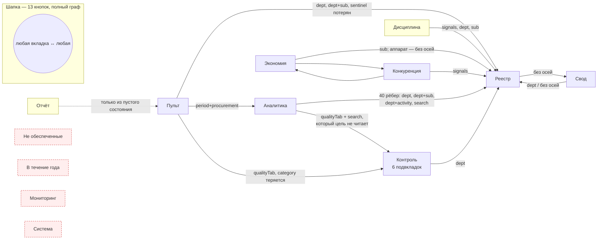

# Карта навигации продукта — узлы, рёбра, потери контекста

Дата: 20.08.2026. Проход читающий: код не менялся, номера строк даны по
состоянию на момент чтения (ветка `main`, HEAD `315b19f`, плюс незакоммиченная
волна правок по Мониторингу и Пульту).

Карта опирается на инвентарь карточек в этой же папке (`pult.md`, `reestr.md`,
`monitoring.md`, `otchet-svod.md`, `economy-competition.md`,
`discipline-quality.md`, `analytics-timeline-system.md`) и на канон
`docs/superpowers/audits/2026-08-14-interview-register.md`. Инвентарь карточек
здесь не повторяется — вопрос этой карты другой: **как читатель попадает из
одного места в другое и что он теряет по дороге**.

Периметр:

- шапка и вкладки — `packages/web/src/components/Header.tsx`;
- развилка страниц — `packages/web/src/App.tsx:156-192`;
- состояние навигации и переходы — `packages/web/src/store.ts:9-29` (`Page`),
  `:248-269` (тип `navigateTo`), `:376-382` (`setPage`), `:528-612` (тело
  `navigateTo`);
- адресная строка — `packages/web/src/hooks/useUrlSync.ts`;
- полоса организаций — `packages/web/src/components/OrgStrip.tsx`;
- чипы отбора — `packages/web/src/components/FilterBreadcrumb.tsx`;
- непроведённая проводка — `packages/web/src/lib/view-state.ts`,
  `packages/web/src/lib/drill.ts`.

---

## 0. Размер графа одним взглядом

| Что | Сколько | Где перечислено |
|---|---|---|
| Вкладки первого уровня (кнопки шапки) | 13 | `Header.tsx:82-101` (`NAV_ITEMS`) |
| Значения `Page` всего | 18 | `store.ts:9-29` (13 живых + 5 легаси-псевдонимов) |
| Состояния второго уровня (подвкладки и режимы) | 20 | §2 |
| Узлов графа итого | 33 | 13 + 20 |
| Рёбер `navigateTo` в коде | 78 | §3, разбивка по целям и файлам |
| Рёбер шапки | 13 × 13 | полный граф: любая вкладка достижима отовсюду |
| Осей, которые умеет везти `navigateTo` | 10 | `store.ts:248-261` |
| Осей, которые доезжают на самом деле | 8 | бюджет и категория теряются — находки Н12, Н05 |
| Параметров в адресной строке | 8 | `useUrlSync.ts:191-238`; вкладки и вида среди них нет |
| Хлебных крошек в продукте | 1 | только внутри круга долей, `DrillPieChart.tsx:596-599` |
| Кнопок «назад» | 0 | поиск по `Назад|Вернуться|history.back|popstate` пуст |

---

## 1. Узлы первого уровня — тринадцать вкладок

Ряд кнопок шапки (`NavPills`, `Header.tsx:579-642`) — единственный постоянный
орган навигации. Он виден на каждой странице, все тринадцать кнопок всегда
нажимаемы, поэтому **недостижимых вкладок в продукте нет**: любой узел
достижим за один щелчок. Всё, что описано ниже как «изолированный узел»,
означает не недостижимость, а отсутствие смыслового шва — попасть можно только
общим списком, а не «отсюда туда».

| Вкладка | `Page` | Что показывает | Оси шапки над ней (`PAGE_FILTERS`, `Header.tsx:20-50`) |
|---|---|---|---|
| Пульт | `dashboard` | сводная панель | период, единицы, способ, вид, бюджет |
| Отчёт | `report` | еженедельный отчёт | период |
| Свод | `svod` | копия листа СВОД | единицы, способ, бюджет |
| Реестр | `data` | построчные данные | период, единицы, способ, вид, бюджет, поиск |
| Не обеспеченные | `unfunded` | корзина Реестра (п.23) | то же, что Реестр |
| В течение года | `yearlong` | корзина Реестра (п.71) | без способа: класс определяется способом |
| Мониторинг | `monitoring` | книга процедур | **ни одной** (п.127: своя книга, свой отбор) |
| Экономия | `economy` | экономия и её конфликты | период, единицы, способ, вид, бюджет |
| Конкуренция | `competition` | ЕП против конкурентных | период, единицы |
| Дисциплина | `discipline` | список дел | период, единицы |
| Контроль | `quality` | шесть подвкладок качества | период, способ, вид |
| Аналитика | `analytics` | разборы и графики | период, единицы, способ, вид, бюджет |
| Система | `settings` | источники и подключение | **ни одной** |

Полоса организаций (`OrgStrip`) — второй, необъявленный орган навигации: она
задаёт ось управлений и подведов и видна везде, **кроме «Отчёта»**
(`App.tsx:211`). Формально это отбор, а не переход, но по действию это
навигация: она меняет содержимое любой открытой вкладки.

Пять легаси-значений `Page` (`recon`, `trust`, `issues`, `recs`, `journal`)
живут в развилке `App.tsx:184-188` и в переводчике `store.ts:597-607`, но
породить их больше нечем — см. находку Н15.

---

## 2. Узлы второго уровня — двадцать состояний

| Родитель | Состояний | Где живёт состояние | Переживает уход со вкладки? | В адресе? |
|---|---|---|---|---|
| Контроль | 6: доверие, сверка, замечания, рекомендации, журнал, табель | `store.qualityTab` (`store.ts:243-244`) | да — глобальное поле store | нет |
| Мониторинг | 5 режимов листа: реестр, сводный, «25-26», справочник, предки (`lib/monitoring/modes.ts:89-95`) | `useState` (`Monitoring.tsx:81`) | **нет** | нет |
| Система | 3: источники, соответствие ячеек, подключение (`Settings.tsx:73-77`) | `useState` (`Settings.tsx:87`) | **нет** | нет |
| Замечания | 2: проверки, гигиена текста | `useState` (`Issues.tsx:283`) | **нет** | нет |
| Экономия | 2: управления, подведы | `useState` (`Economy.tsx:109`) | **нет** | нет |
| Реестр | 2: просмотр, редактор (`DataBrowser.tsx:67`) | `useState` + сохранённые предпочтения (`:301`) | вид — да (localStorage), отбор — нет | нет |

Сверх того — локальный стек разрезов круга долей на Пульте: управление →
способ → бюджет (`DrillPieChart.tsx:305, 571-593`). У него есть собственная
крошка (`:596-599`) и он умирает при уходе со страницы.

Разрезы Мониторинга (`SliceState`, `Monitoring.tsx:82`) — местный отбор
вкладки: год, квартал, стадия, заказчик. Тоже `useState`, тоже вне адреса.

---

## 3. Рёбра `navigateTo` — семьдесят восемь переходов

### 3.1. Куда ведут

| Цель | Рёбер | Чтение |
|---|---|---|
| `data` (Реестр) | 59 | Реестр — сток продукта: три четверти всех переходов ведут туда |
| `quality` (Контроль) | 14 | второй сток |
| `svod` | 1 | `DataBrowser.tsx:1448` |
| `economy` | 1 | `CostOfRefusal.tsx:271` |
| `competition` | 1 | `Economy.tsx:497` |
| `analytics` | 1 | `Dashboard.tsx:241` (квартал плана и факта) |
| `dashboard` | 1 | `Report.tsx:971`, и только из пустого состояния |
| `monitoring`, `report`, `discipline`, `unfunded`, `yearlong`, `settings` | **0** | входящих смысловых швов нет вовсе |

### 3.2. Откуда ведут

| Файл | Рёбер |
|---|---|
| `pages/Analytics.tsx` | 40 |
| `pages/Economy.tsx` | 5 |
| `pages/Dashboard.tsx` | 5 |
| `pages/Discipline.tsx` | 4 |
| `components/dashboard/DeptPortrait.tsx` | 4 |
| `pages/Trust.tsx` | 3 |
| `pages/SvodView.tsx` | 3 |
| `pages/Recon.tsx`, `pages/DataBrowser.tsx`, `components/timeline/UpcomingSection.tsx` | по 2 |
| `pages/Report.tsx`, `pages/Issues.tsx`, `components/workload/WorkloadSection.tsx`, `components/competition/EpJustification.tsx`, `components/competition/CostOfRefusal.tsx`, `components/analytics-extra/IntegritySection.tsx`, `components/analytics-extra/AnomalySignsSection.tsx` | по 1 |

### 3.3. Что переход умеет везти

`navigateTo(page, filters)` объявляет десять осей (`store.ts:248-261`). По телу
функции (`store.ts:536-611`) видно, что делает каждая:

| Ось | Что происходит | Оговорка |
|---|---|---|
| `department` | `selectedDepartments = {канон}` | ключ канонизируется в кириллицу (`toCanonicalDeptId`) |
| `subordinate` | `selectedSubordinates = {имя}` | сравнение по displayName; сентинел аппарата поддержан обеими сторонами |
| `period` / `months` | атомарно: период, месяцы, барабан, режим | месяц вытесняет квартал: при `months` период всегда `year` |
| `year` | `year` | |
| `procurement` | `procurementFilter` + `selectedMethods` | |
| `activity` | `activityFilter` + `selectedActivities` | |
| `search` | оба поля поиска, отложенный пересчёт снимается | глобальный отбор, живёт после перехода |
| `signals` | `registrySignalSeed` — затравка на один вход в Реестр | потребляет только Реестр (`DataBrowser.tsx:313-320`) |
| `qualityTab` | подвкладка Контроля | |
| `category` | **ничего** | единственное употребление — выбор вкладки (`store.ts:608`); поля состояния нет |

Не объявлено вовсе: **бюджет**. `selectedBudgets` не входит в список
обновляемых полей (`store.ts:529-535`), хотя и Реестр, и все страницы по нему
сужают. Ось молча теряется на любом переходе.

### 3.4. Адресная строка

`useUrlSync` (`hooks/useUrlSync.ts`) кладёт в адрес восемь параметров отбора:
`year`, `period`, `months`, `depts`, `subs`, `method`, `activity`, `budget`.
В адресе **нет** ни вкладки, ни подвкладки, ни режима листа, ни сортировки, ни
номера страницы. Запись идёт через `history.replaceState` (`:242`), то есть
записей истории продукт не создаёт вовсе.

---

## 4. Граф

Красным — узлы без единого смыслового шва в обе стороны (только кнопка шапки).
Жёлтым — узлы, из которых выйти можно, а войти по смыслу нельзя.

Обратных рёбер на схеме нет ни одного, и это не упрощение картинки: возврата
в продукте не существует (находка Н02).

---

## 5. Находки

Приоритеты: **P0** — ломает смысл (читатель видит не те числа или не может
сделать то, ради чего пришёл); **P1** — удивляет пользователя (работает не так,
как обещает экран); **P2** — неудобно.

### P0

**Н01. Ссылки на экран не существует.**
`hooks/useUrlSync.ts:191-242` пишет в адрес только восемь осей отбора и делает
`replaceState`. Вкладка, подвкладка Контроля, режим листа Мониторинга,
сортировка и страница Реестра в адрес не попадают. Любая присланная ссылка
открывает **Пульт** — с чужими фильтрами и без того экрана, ради которого её
послали. Это ровно та жалоба, что записана в трёх картах карточек подряд
(`monitoring.md` §1.5 п.5, `analytics-timeline-system.md` «Чего не хватает» п.2,
`economy-competition.md` §«Фильтры»).
*Предложение:* писать `tab` и поля вида — готовый механизм уже написан и
покрыт тестами: `lib/view-state.ts:541-545` (`TAB_PARAM`, `VIEW_PREFIX`,
`PICK_PREFIX`), `serializeAddress`/`parseAddress` (`:607, :638`). Достаточно
подключить его к `useUrlSync` вместо второй схемы тех же осей.

**Н02. Возврата нет ни браузерного, ни продуктового.**
`replaceState` (`useUrlSync.ts:242`) не создаёт записей истории, поэтому кнопка
«Назад» браузера уводит из продукта целиком. Внутри продукта кнопок «назад»
ноль (поиск по `Назад|Вернуться|history.back|popstate|goBack` даёт два
попадания, и оба — сброс локального состояния: `DrillPieChart.tsx:720` и
`Report.tsx:1232`). Провалившись из Аналитики в Реестр, читатель не может
вернуться к точке отправления: отбор шапки уже перезаписан переходом, и
восстанавливать его надо руками.
*Предложение:* `pushState` при смене вкладки, чтение `popstate` в `useUrlSync`,
плюс явная строка «← вернуться на Аналитику» на странице, куда провалились
(источник перехода известен в момент вызова `navigateTo`).

**Н03. Механизм, который лечит половину этой карты, написан и не подключён.**
`lib/drill.ts` (481 строка) собирает цель перехода из точки клика целиком и
честно называет оси, которые до цели не доезжают; `lib/view-state.ts` (700
строк) кладёт вид экрана в адрес. Оба импортируются **только своими
тестами** — `drill.test.ts` и `view-state.test.ts`; ни одного употребления в
`pages/**` или `components/**`. Все 78 переходов до сих пор собирают цель
руками, и каждый помнит про свою ось.
*Предложение:* включить `drill.ts` первым делом в места с самыми дорогими
потерями (Аналитика — 40 рёбер, круг долей Пульта, адреса строк), а
`view-state.ts` — в `useUrlSync`. Отдельной разработки это не требует.

**Н04. Переход «Аналитика → Контроль» кладёт поиск, которого цель не читает.**
`pages/Analytics.tsx:757-760`: клик по карточке показателя вызывает
`navigateTo('quality', { qualityTab: hasWarning ? 'recon' : 'trust', search: card.label })`.
Ни `Trust.tsx`, ни `Recon.tsx` `searchQuery` не читают (в обоих файлах поле не
употребляется ни разу). Поле ввода поиска на «Контроле» шапка не показывает —
`PAGE_FILTERS.quality` (`Header.tsx:43`) поиска не содержит. Итог: отбор в цели
ничего не делает, но остаётся жить в store и режет Реестр и «Замечания» при
следующем переходе — читатель увидит там подмножество строк и не поймёт почему.
Чип с крестиком его назовёт (`FilterBreadcrumb.tsx:167-173`), но связь между
подписью показателя и обрезанным Реестром прочитать невозможно.
*Предложение:* поиск на «Контроль» не передавать; вести на карточку показателя
или на `qualityTab: 'issues'` с осью `department`.

**Н05. Ключ сигнала объявлен, выбрасывается, и отбор едет русской подстрокой.**
Карточки сигналов Пульта зовут `onNavigate(spot.signal, spot.search)`
(`Dashboard.tsx:1388`), обработчик — `navigateTo('quality', { category, search })`
(`Dashboard.tsx:756`). Ось `category` объявлена в типе (`store.ts:257`), но в
теле `navigateTo` ей не соответствует ни одно поле состояния: единственное
употребление (`store.ts:608`) решает лишь, какую подвкладку открыть. Значит
ключ сигнала (`overdue`, `economyConflict`, `planYearMissing`) теряется, а
отбор едет строками `'просрочк'`, `'флаг эконом'`, `'без года плана'`
(`Dashboard.tsx:1244-1288`) — поиском по человеческому тексту. Любая
переформулировка подписи замечания рвёт переход молча: список окажется пустым,
и экран не сможет объяснить, почему.
*Предложение:* везти `signals: [spot.signal]` — механизм затравки уже есть и
уже работает у «Дисциплины» (`store.ts:536-540`, `DataBrowser.tsx:313-320`);
для «Замечаний» завести такой же отбор по ключу правила.

### P1

**Н06. Мониторинг — полностью изолированный узел.**
Входящих переходов ноль (`navigateTo('monitoring')` не встречается нигде).
Исходящих ноль: во всех 23 файлах `components/monitoring/**` нет ни одного
употребления `navigateTo` или `useStore`. Вкладка с пятью режимами листа,
разрезами и карточкой процедуры живёт как остров: войти — только кнопкой
шапки, выйти — только кнопкой шапки. При этом канон п.101а требует маппинга
процедур на строки книг управлений, то есть шов «процедура ↔ строка Реестра»
предусмотрен смыслом.
*Предложение:* из карточки процедуры — «строки этой закупки в Реестре»
(управление плюс предмет либо код), из строки Реестра — обратная ссылка на
процедуру. Оси для этого у `drill.ts` уже описаны (`procedure`, местный отбор
вкладки — `DrillCarrier: 'local'`).

**Н07. Провал в круге долей Пульта не ведёт никуда.**
`DrillPieChart.tsx:142` объявляет проп `onNavigate`, Пульт его передаёт
(`Dashboard.tsx:748`), но тело компонента его **не вызывает ни разу**:
единственные употребления имени — объявление типа и деструктуризация соседнего
`onDeptToggle` (`:140, :249, :931-933`). Читатель раскрывает круг до
«УО → ЕП → МБ» (`:571-593`) и оказывается в тупике: увидеть строки, из которых
сложен этот сектор, нельзя, а стек разрезов умрёт при уходе со страницы.
*Предложение:* подключить `onNavigate` к активному сектору, собирая точку через
`drill.ts` — она уже умеет складывать управление, способ и бюджет вместе.

**Н08. Адреса строк ведут текстом вместо ключа.**
Систематический приём, пять мест:
`components/analytics-extra/AnomalySignsSection.tsx:80-83` (кнопка подписана
«строка 314», а везёт `search: subject.slice(0, 60)`);
`components/analytics-extra/IntegritySection.tsx:125-128` (строки **без**
номера — везёт обрезанный предмет, а если предмет пуст, открывается всё
управление); `pages/Analytics.tsx:2013-2016` (кнопка показывает «строки 12, 15,
18», везёт общий предмет группы); `pages/Analytics.tsx:2149` (категория как
поисковая строка); `components/dashboard/DeptPortrait.tsx:287` (заголовок
замечания как поисковый запрос). Реестр фильтровать по номеру строки не умеет
вовсе: серверный поиск идёт по предмету, способу, статусу, имени управления и
подведу (`packages/server/src/services/rows-filters.ts:36-44`).
*Предложение:* завести в Реестре ось «строка листа» (`sheetRow`/`rowSeq`) и
возить её переходом; до этого — не подписывать кнопку номером строки, раз
номер не доезжает.

**Н09. Один и тот же столбец разбивки ведёт себя двумя способами.**
На Пульте в режиме подведов клик по организации открывает Реестр
(`Dashboard.tsx:1131-1137`), а в обычном режиме тот же по виду столбец лишь
переключает отбор шапки (`Dashboard.tsx:1141-1154`) — причём повторный клик
отбор снимает. Жест один, результат разный, предупреждения нет.
*Предложение:* развести жесты во всех разбивках: клик по телу столбца — отбор,
отдельная стрелка — переход.

**Н10. Аппарат управления теряется на переходе.**
`pages/Economy.tsx:198`: клик по «Аппарату управления» уходит как
`navigateTo('data')` вообще без осей — выборка расширяется с аппарата до всего,
что стояло в шапке. `components/dashboard/DeptPortrait.tsx:339` шлёт
`subordinate: s.name`, не проверяя сентинел, — в отличие от соседнего места
(`Dashboard.tsx:1134-1136`), которое сентинел разбирает. Между тем ключ
`_org_itself` понимают обе стороны: клиент — `lib/selectors/subordinate-override.ts:27-30`,
сервер — `packages/server/src/services/rows-filters.ts:72-77`.
*Предложение:* везти `subordinate: ORG_ITSELF_SENTINEL` — ось поддержана
насквозь, терять её незачем.

**Н11. Локальный поиск «Замечаний» не отпускает снятый чип.**
`pages/Issues.tsx:274-276`: глобальный запрос копируется в локальное поле, но
только когда он непустой. Читатель снимает чип «поиск: просрочк» в шапке,
глобальный отбор уходит — локальное поле остаётся заполненным, и список
по-прежнему сужен. Крестик у чипа обещает снятие отбора, а отбор остаётся.
*Предложение:* синхронизировать в обе стороны, включая пустое значение.

**Н12. Ось бюджета не доезжает никуда.**
`store.ts:529-535`: `selectedBudgets` не входит в список полей, которые
`navigateTo` умеет обновлять, хотя Реестр (`DataBrowser.tsx:294`) и
`useFilteredData` по бюджету сужают. Любая точка, за которой стоит уровень
бюджета (столбцы ФБ/КБ/МБ, сектор бюджета в круге), при провале молча теряет
эту ось: читатель щёлкнул по муниципальному столбцу, а увидел все три бюджета
разом. Сейчас ущерб частично скрыт тем, что единственный бюджетный провал
(круг долей) вообще не работает — см. Н07.
*Предложение:* добавить ось в `navigateTo` либо, если она сознательно не
передаётся, называть потерю словами в месте клика — механизм `dropped` в
`drill.ts:22-42` для этого и написан.

**Н13. Пятнадцать «Открыть Реестр» без единой оси.**
`navigateTo('data')` без параметров: `UpcomingSection.tsx:335, 355`,
`Analytics.tsx:826, 954, 1062, 1101, 1312, 1520, 1903`, `Discipline.tsx:222,
378`, `Economy.tsx:198, 279`, `SvodView.tsx:559, 684`. Почти все — пустые
состояния и подписи под блоками: «данных нет, откройте Реестр». Читатель
приходит из блока «просроченные закупки III квартала по УО», а открывается всё,
что было в шапке.
*Предложение:* даже пустое состояние знает свой периметр — собирать точку через
`drill.ts` и передавать её.

**Н14. Период и вид деятельности на «Своде» действуют, но барабана шапки там нет.**
`PAGE_FILTERS.svod` (`Header.tsx:23`) — только единицы, способ и бюджет. При
этом `SvodView.tsx:215-226` считает и по `selectedActivities`, и по периоду, а
вместо барабана на странице стоит собственный ряд кнопок периода
(`SvodView.tsx:229-231, 490-538`), пишущий в те же поля store. Одна ось — два
разных органа управления в разных местах экрана, в зависимости от вкладки.
Читатель, выбравший квартал на «Своде», обнаружит его барабаном на Реестре и не
вспомнит, где его включил.
*Предложение:* либо вернуть барабан на «Свод», либо признать местный ряд
единственным органом и объяснить это на самой странице.

**Н15. Пять недостижимых значений `Page` держат живую развилку.**
`App.tsx:184-188` разбирает `recon`, `trust`, `issues`, `recs`, `journal`;
`store.ts:376-382` и `:597-607` их переводят; `Header.tsx:666-673` сворачивает
их обратно в `quality`. Породить такое значение нечем: шапка их не знает
(`NAV_ITEMS`, `Header.tsx:82-101`), адрес вкладку не хранит, все отправители
давно перешли на `quality` плюс `qualityTab`.
*Предложение:* снять пять веток, пять значений типа и переводчик `activePage`
одним проходом — читателю кода они обещают маршруты, которых нет.

### P2

**Н16. Хлебных крошек в продукте нет.**
Единственная настоящая крошка — внутри круга долей (`DrillPieChart.tsx:596-599`,
разметка `:690-720`). `FilterBreadcrumb` названа крошкой, но показывает не
путь, а действующие отборы. Провалившийся в Реестр читатель не видит, откуда
пришёл и что именно из его выбора доехало.
*Предложение:* строка «Пульт → Реестр · УО · III квартал» над содержимым, с
возвратом по каждому звену; данные для неё уже собираются в `drill.ts`.

**Н17. Число на кнопке корзины и число на открытой корзине считаются по-разному.**
`Header.tsx:583-593` показывает `bucketCounts` — счёт «во всех книгах на сейчас»
(`store.ts:326-333`), не сужаемый отбором. Открытая корзина сужается шапкой.
Читатель видит на кнопке 214, входит и видит 37.
*Предложение:* оговорка «во всех книгах» живёт только в подсказке при
наведении — вынести её к числу.

**Н18. Обещание кнопки «Итоги выборки — в сетке Свода» проверить нечем.**
`DataBrowser.tsx:1448-1452` обещает подсказкой, что период сохранится. По
числам это правда, но на «Своде» органа периода в шапке нет (Н14), и убедиться,
что доехало именно III квартал, читателю негде, кроме чипа.

**Н19. Корзины Реестра — тупики.**
Кнопка «в сетке Свода» скрыта при открытой корзине (`DataBrowser.tsx:1446`,
условие `!bucket`), других исходящих переходов у корзин нет. Войти можно только
кнопкой шапки, выйти — только ею же. При этом карточка сигнала «без года плана»
на Пульте (`Dashboard.tsx:1276-1282`) ведёт не в корзину «Не обеспеченные», а в
«Контроль» текстовым поиском — два пути к одному классу строк, и продукт
выбирает хрупкий.

**Н20. Подпись серверного поиска обещает реестровый номер.**
`packages/server/src/services/rows-filters.ts:39` — «Поиск по
предмету/способу/статусу/реестровому номеру/подведу», а `SEARCH_FIELDS`
(`:36-37`) номера не содержит. Либо добавить поле (и тогда закрыть Н08 малой
кровью), либо поправить строку.

**Н21. Тип мёртвого пропа вдобавок сужает цель.**
`DrillPieChart.tsx:142`: `onNavigate?: (page: 'analytics', opts?: any) => void`.
Проп не вызывается (Н07), а объявленный тип разрешает единственную цель, хотя
Пульт передаёт полноценный `navigateTo`. Если проп оживлять — тип придётся
переписывать вместе с ним.

**Н22. Три разных дороги к одному месту с разным набором осей.**
Строки замечаний открываются: карточкой сигнала Пульта (текстовый поиск,
`Dashboard.tsx:1388`), полосой критических замечаний (`Dashboard.tsx:463` — без
единой оси), таблицей Аналитики (`Analytics.tsx:1502` — с управлением). Три
входа в одну вкладку дают три разных выборки, и читатель не знает, какая из них
отвечает на его вопрос.

---

## 6. Сводка по приоритетам

| Приоритет | Находок | Номера |
|---|---|---|
| P0 — ломает смысл | 5 | Н01–Н05 |
| P1 — удивляет пользователя | 10 | Н06–Н15 |
| P2 — неудобно | 7 | Н16–Н22 |
| Всего | 22 | |

Общий диагноз. Навигация продукта — **звезда без обратных рёбер**: центр
(шапка) достаёт до всего, а между собой узлы связаны односторонне и
неравномерно. Три четверти переходов ведут в Реестр, шесть вкладок не имеют ни
одного смыслового входа, возврата нет нигде, и ни одно состояние экрана не
переживает пересылку ссылки. При этом инструмент, чинящий и потерю осей, и
адресуемость, уже написан, покрыт тестами и лежит неподключённым
(`lib/drill.ts`, `lib/view-state.ts`) — это самая дешёвая точка приложения
усилий во всей карте.
