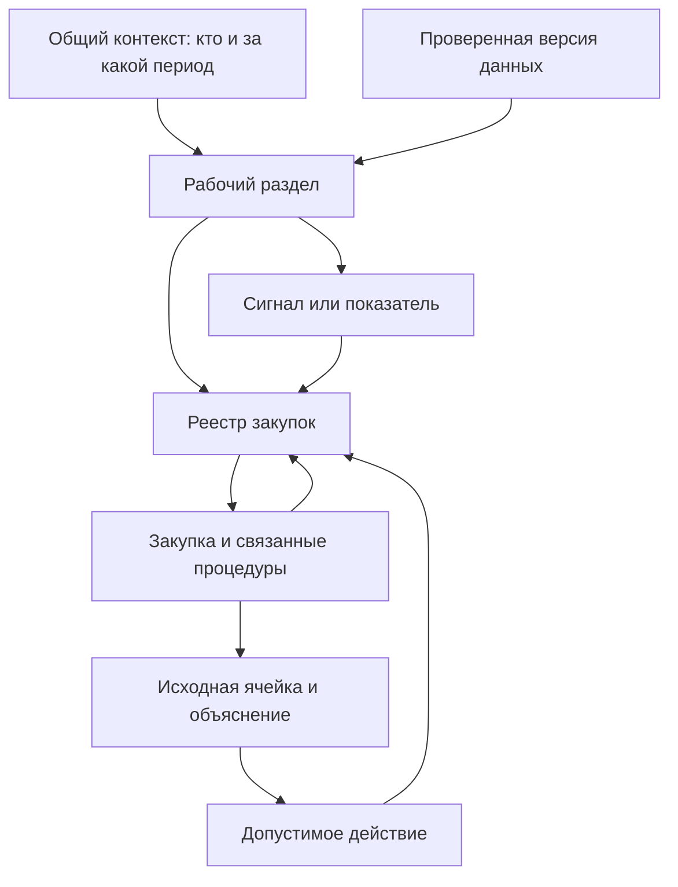
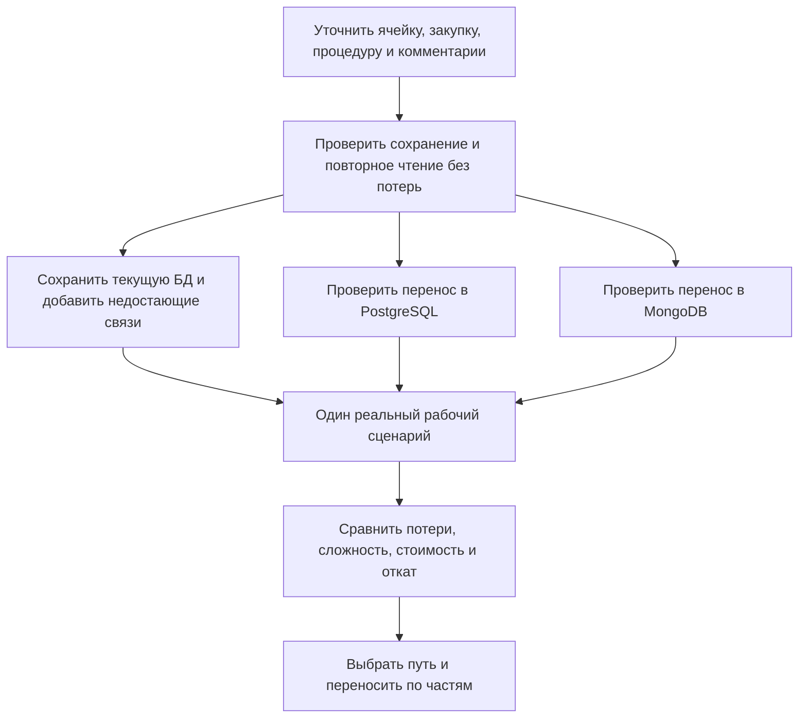

# Dash: выбранная основа следующего дизайна

Это конкретное предложение для следующей версии, а не отметка о приёмке. Основание — требования владельца, исходные HTML и код `2461209c8d0172c4acf94f5606452c589cd4f510`. Пульс изучен как источник общей оболочки; переделка его страницы исключена. Предыдущий прототип Codex не принят и не становится основой автоматически.

## Что именно объединяем

Dash должен ощущаться одним рабочим местом: человек замечает изменение, понимает его причину, открывает исходную закупку, проверяет число и возвращается в прежний отбор. Внешний вид должен сохранять узнаваемые предметы проекта — щит, барабаны, угол отбора, внутреннюю живую «Зарю». Для этого недостаточно перекрасить карточки или перенести текст в тесных кнопках.

| Часть | Выбранное решение | Что необходимо улучшить |
|---|---|---|
| Навигация | Барабан из `pulse.html`, все 13 существующих маршрутов | Полные названия; доступ через явный список разделов и клавиатуру; выбранный раздел всегда виден. Длинная строка «Реестры» делится на две предусмотренные строки, а не сжимает четыре кнопки до нечитаемости. |
| Годы и недели | Существующие предметы приложения и их физика | Сохранить многолетний отбор, частичный выбор, будущие периоды и недельный снимок. Не подменять их декоративными переключателями. |
| Угол отбора | Узнаваемая решётка из 12 позиций плюс раскрытие и действия варианта Б из `ugol-varianty.html` | Список человеческими словами, снятие отдельного условия, явный общий сброс, возврат. Решётка остаётся знаком состояния; смысл доступен без запоминания цветового кода. |
| Обновления | Разделение «Что изменилось / Комментарии / Откуда числа» из `efir-uzel-schita.html` | Показывать только подтверждённую стадию чтения. Сохранить отложенное обновление, ошибку и повторную попытку из действующего приложения. |
| Цвет | Свободные пары «Зари», тематическое семейство «Космос» как выбранное для следующего эскиза | Это предложение исполнителя, не уже одобренная палитра. Смысловые цвета тревоги и бюджетов не перекрашивать в цвет вкладки. |
| Материал | Кэнди для активного предмета, спокойный металл для действий, существующее стекло барабанов | Не складывать стекло, лак и искры на одной поверхности. Данные и длинный текст читать на спокойной непрозрачной подложке. |
| Переход в подробности | Путь вниз и назад, память контекста из controls/Pulse | Привязать к настоящей строке и процедуре. Возврат восстанавливает выделение, отбор, прокрутку и фокус. |

Выбор уточняет, а не отменяет поздние требования: [§21.1, особенно поправка 7а](../../specs/2026-08-22-pulse-feedback-2.md) снимает обязательность единого бронзового горизонта. Более ранняя [матрица](../../specs/2026-08-29-zarya-matrica.md) полезна для состояний, но её общий горизонт уже не обязательный закон. Исходный [свод требований](../../specs/2026-08-29-idealnyj-prompt.md) остаётся ссылочным документом; ещё один конкурирующий «канон» не создаём.

## Как должно быть устроено рабочее место

У оболочки три устойчивые области. Первая отвечает «где я»: выбранный раздел, навигационный барабан и доступный список всех разделов. Вторая — «на что смотрю»: организация, период, недельный снимок, действующие условия. Третья — «чему могу доверять»: последнее успешное чтение, изменения, происхождение чисел. При нехватке ширины области занимают предусмотренные ряды. Внутри кнопок названия остаются целыми; уменьшение шрифта, троеточие и подсказка не служат ремонтом компоновки.

Точные ширины перехода между компоновками выбираются по измеренному содержимому настоящих компонентов. Макет нельзя считать адаптивным по одному снимку. Проверка следующей реализации: 1440, 1280, 1024, 768 и 390 px, масштаб текста 200%, длинные названия учреждений, управление без мыши. На узком экране явный выбор раздела может стать основным способом; барабан не должен быть единственной скрытой возможностью перехода.

Угол показывает четыре семейства — когда, кто, что, как. Но «как» содержит режимы расчёта и отображения, а не только фильтры: тысячи/миллионы не меняют закупки, ставка не должна молча менять чужой показатель. В раскрытии эти различия названы. Не действующее на странице условие не изображает отбор её данных. Общий сброс возвращает документированное начальное состояние; отдельное действие «Все годы» остаётся доступным. Для следующей версии предлагается сохранять возврат сброса до следующего изменения отбора, а не требовать успеть за шесть секунд. Это намеренное изменение поведения, требующее отдельной приёмки.

## Что уже есть в ядре и приложении

| Возможность | Фактическое состояние | Следствие для дизайна |
|---|---|---|
| 13 разделов и группы навигации | `App.tsx`, `Header.tsx`; действующая навигация — NavPills, не барабан разделов из HTML | Сохранить все маршруты. Барабан навигации ещё нужно связать с ними. Барабаны года/недели уже существуют. |
| Условия по страницам | `store.ts`, `PAGE_FILTERS`, `SelectionTokens` | Один контекст с явными возможностями страницы, а не обещание «все условия действуют везде». |
| Последние изменения и щадящее обновление | `LiveHistory`, `LiveUpdateBar`, SeamlessRefresh уже реализованы | Нижнюю полосу нельзя просто удалить: её причины появления и действия должны переехать в новый узел. |
| Проверки массивов данных | `runPipeline` → снимок `datasetAnalyses` → `Analytics.tsx` / `DatasetAuditCard` | Старое утверждение «есть на бэке, совсем нет во фронте» уже неверно. Улучшать путь к доказательству и адресам. |
| Оценка и контроль правил | Сервер `routes/analytics.ts` → `useScorecard` → `Quality.tsx` | Уже выведено. При этом периоды и основания отдельных оценок ограничены; интерфейс должен это объяснять до вывода. |
| Формула и рассчитанное значение | Google Sheets читается в двух представлениях; есть `{v,f}` | Нужен целостный договор о ячейке. Два отдельных чтения ещё не доказывают одновременность формулы и результата. |
| Комментарии Drive | Читаются автор, текст, даты, закрытие и количество ответов | Полное содержание ответов и доказанный адрес ячейки этим контрактом не обеспечены. Нельзя рисовать готовое «ответить/закрыть», не проверив поддержку записи. |
| Недельная история | Есть `weeklyTableContext`, заголовки, формулы и процедурные листы, привязанные к снимку | Развивать существующее сохранение; не проектировать архив с нуля. Локальные тесты этого участка требуют отдельного разбора. |

Опорные места: `packages/web/src/{App.tsx,store.ts,components/Header.tsx,pages/Analytics.tsx,pages/Quality.tsx}`, `packages/server/src/{routes/analytics.ts,services/google-sheets.ts,services/snapshot.ts}`, `packages/core/src/pipeline/orchestrator.ts`. Это карта обследованных связей, не утверждение о прочтении каждой строки всего репозитория.

Различия страниц принципиальны. Мониторинг имеет собственную процедурную книгу, рубли и свой отбор; общий квартал нельзя автоматически приписать его числам. Конкуренция сравнивает способы и не должна скрывать половину сравнения общим переключателем способа. Дисциплина имеет ограничения годового расчёта. Ставка «8% / живая» в текущем store относится к ожидаемой экономии Отчёта. Свод не поддерживает тот же набор периодов, что Реестр. Эти различия должны быть видны человеку, а не становиться разными скрытыми трактовками одной кнопки.

## Какие данные нужно связать

| Понятное название | Что хранить и показывать | Что нельзя смешивать |
|---|---|---|
| Строка исходного листа | Книга, рабочий лист, адрес в момент чтения, исходные клетки | Позицию строки и постоянную сущность закупки |
| Закупка | Устойчивый идентификатор, организация, предмет, ссылки на версии исходных строк | Идентификатор и пользовательский «№ п/п», в том числе `173/1` |
| Процедура | Собственный код, этапы, участники и связь с закупками | Одну процедуру с одной строкой плана: связь может быть множественной |
| Ячейка | Введённое содержимое, формула, вычисленный результат, отображаемый текст, тип/формат, момент чтения | Формулу, её результат и отформатированную строку |
| Примечание ячейки | Текст и точный адрес ячейки | Примечание и обсуждение с ответами |
| Обсуждение | Сообщения, авторы, даты, ответы, закрытие, надёжность привязки | Совпадение процитированного текста и доказанную привязку к единственной ячейке |
| Поля замечаний в таблице | AF/AG/AH и их собственный смысл | Эти столбцы и два предыдущих вида комментариев |
| Проверка | Правило и версия, основание, охват, доказательства, неопределённость | Сигнал риска и доказанное нарушение |
| Снимок | Согласованный опубликованный набор, версия правил и времена чтения каждой книги | Время публикации и утверждение, что все книги прочитаны одновременно |

Принцип: исходный слой сохраняет то, что пришло; предметный слой объясняет, что это означает; опубликованный снимок фиксирует, по чему рассчитан экран. Исправление человека и автоматический вывод имеют разные авторство и историю. Изменение исходной книги после открытия карточки должно обнаруживаться до записи.

Договор о показателе включает значение или причину отсутствия, единицу, применённый отбор, период, версию данных, способ расчёта и ссылки на исходные строки. Ноль означает измеренный ноль. «Не читали», «нет данных», «период ещё не наступил» и «расчёт неприменим» — разные состояния.

## Ограничения, которые нельзя закрасить

1. **Сигналы о номерах действительно требуют ремонта.** В `shared/rule-book.ts` правило `row_numbering` использует `toNumber`, а тот — `parseFloat`. Поэтому `173/1` превращается в `173`. При этом `shared/sequence-integrity.ts` сравнивает номера как строки. Два механизма способны дать разные ответы. Нужна одна политика идентичности и проверка составных номеров. Повтор «№ п/п» ещё не доказывает повтор закупки или расхода; пропуск номера сам по себе не доказывает удаление.
2. **Уже опубликованные JSON — результат прежнего обследования, не новая выгрузка.** Там зафиксированы 5 565 ложных позиций «нет номера», два действительно пустых номера УЭР и 11 групп точных повторов меток. Дубликаты кодов процедур в том обследовании не найдены. Числа нельзя переносить на сегодняшний живой набор без нового замера. Исходные таблицы в эту работу не добавляются.
3. **Макеты содержат демонстрационную предметную логику.** В Pulse часть разрезов получается перемножением долей, ставка задана константой, а некоторые объяснения называют N/Q денежными графами. В действующей предметной модели N/Q — основные даты. Не переносить формулы, основания порогов и правовые утверждения из макета как проверенную спецификацию.
4. **Экономия — отдельный показатель.** Для соответствующего расчёта используются Z+AA+AB и отметка AD; снижение цены процедуры и остаток лимита — другие величины. Формула «план минус факт» не является универсальной экономией. Значение K различается по организациям; нельзя повсеместно объявить его НМЦК.
5. **Предварительное уведомление о книге ещё не равно прочитанной правке.** Текущие события сервера описывают результат чтения и пересчёта. Для точной двухступенчатой схемы из HTML нужен отдельный контракт начальной стадии, привязанный к книге и операции. Один общий флаг ожидания не выдерживает одновременных обновлений разных книг.
6. **Функции бэка оценивать по текущим связям.** Старый аудит от июля отстаёт от кода: часть аналитики уже выведена. Остаточные ограничения нужно фиксировать для каждого результата, а не провозглашать общий «фронт ничего не использует».

## Развилки по структуре данных

Выбор движка сейчас не закрыт. Сначала одинаковые примеры должны пережить запись, чтение, изменение и восстановление истории: составной номер; связь нескольких строк с процедурой; формула с результатом; оба вида комментариев; перемещение строки; конфликт одновременных изменений. PostgreSQL можно оценивать для связей и транзакций с сохранением исходных клеток в JSON; MongoDB — для документов и истории исходников, отдельно доказывая междокументные связи и согласованность. Существующая БД остаётся допустимым переходным вариантом. Большой перенос не является предпосылкой исправления навигации.

## Порядок разработки без выдуманного основания

Первый законченный сценарий: **сигнал → конкретная закупка → связанные процедуры → источник/формула/значение/замечания → допустимое действие → возврат**. Он проверяет и архитектуру, и удобство. Общая оболочка строится на существующем store и маршрутах; расчёты из HTML не копируются.

| Шаг | Конкретный результат | Условие перехода дальше |
|---|---|---|
| 1. Согласовать модель результата | Составной номер, периметр, происхождение, виды комментариев и состояния отсутствия имеют однозначный смысл | На подготовленных примерах две проверки нумерации не противоречат друг другу; связь не угадывается по ближайшей сумме |
| 2. Собрать оболочку | Все маршруты, барабаны, угол и обновления работают с настоящим состоянием | Полные названия; клавиатура; сохранение отбора и возврата; ошибка обновления не теряется |
| 3. Довести один сквозной сценарий | Реальная карточка закупки с доказательствами и доступными действиями | Нет обещанных кнопок без серверного контракта; формула и значение различены; история воспроизводима |
| 4. Применить визуальную систему | «Заря», состояния, материал и типографика на настоящих компонентах | Светлая/тёмная темы, уменьшение движения, масштаб текста, контраст на реальных подложках и отсутствие перекрытий проверены |
| 5. Распространить на остальные разделы | Общие компоненты и явные особенности каждого раздела | Матрица функций до/после без утрат; Пульс не переделывается в этом объёме |

Приёмка предмета ведётся по состояниям: покой, наведение, нажатие, выбран, частичный выбор, фокус, недоступен, загрузка, нет данных, ошибка. Красивый первый экран не заменяет эту проверку. Для контраста берётся худший участок движущегося градиента и реальная подложка стекла; числа у крайних цветов из HTML ещё не удостоверяют всю композицию.

Apple HIG полезен принципами иерархии, читаемости, обратной связи и адаптации материалов, а не копированием отдельных эффектов: [Materials](https://developer.apple.com/design/human-interface-guidelines/materials), [Motion](https://developer.apple.com/design/human-interface-guidelines/motion). Применение этих принципов к Dash здесь — проектное решение исполнителя. Название Apple и установленный навык не заменяют проверку результата.

## Рабочее задание следующему Codex / Claude

> Продолжай от проверенной ревизии и этого разбора. Цель — единое рабочее место Dash с сохранением функций и узнаваемого дизайна; Пульс исключён из переделки. Сначала сопоставь изменения после указанного SHA. Для каждой предлагаемой кнопки назови задачу человека, состояние, реальные данные и действие сервера. Исправляй обнаруженные противоречия постановки и предлагай обоснованный выбор; не требуй от владельца заново перечислять уже известные требования. Реализуй один сквозной сценарий и общую оболочку, затем распространяй систему. Не переносишь демонстрационные расчёты и придуманные основания из HTML. Показывай сравнительные снимки настоящих компонентов и матрицу сохранённых функций. В конце фиксируй выполненное, конкретные проверки и оставшиеся ограничения в этом же PR.

Процесс: Superpowers для постановки и поиска первопричины; Product Design/Impeccable для компоновки и состояний; проверки репозитория для фактического результата. Новые навыки устанавливаются только при выявленном пробеле. Повторное исследование неизменных файлов и повторные полные прогоны без новой причины не нужны. Это ограничение расходов, а не снижение планки исполнения.
