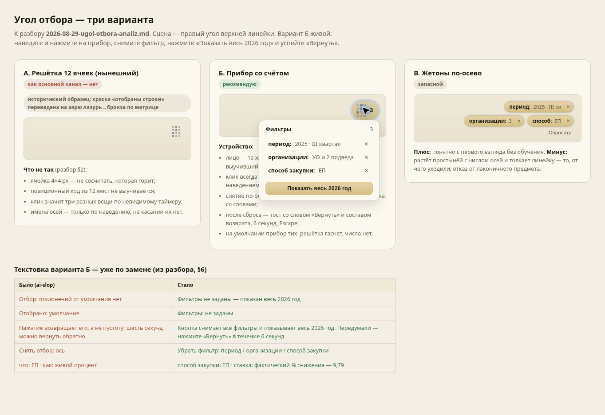
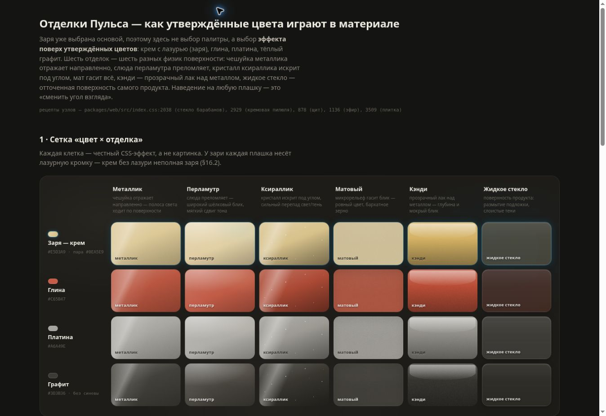
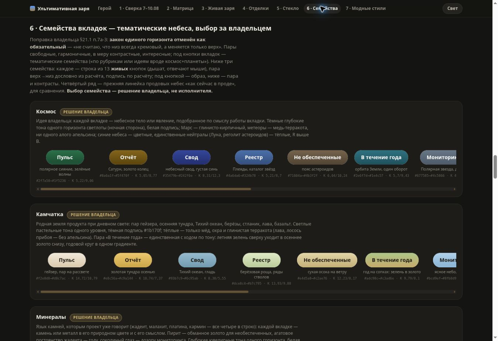
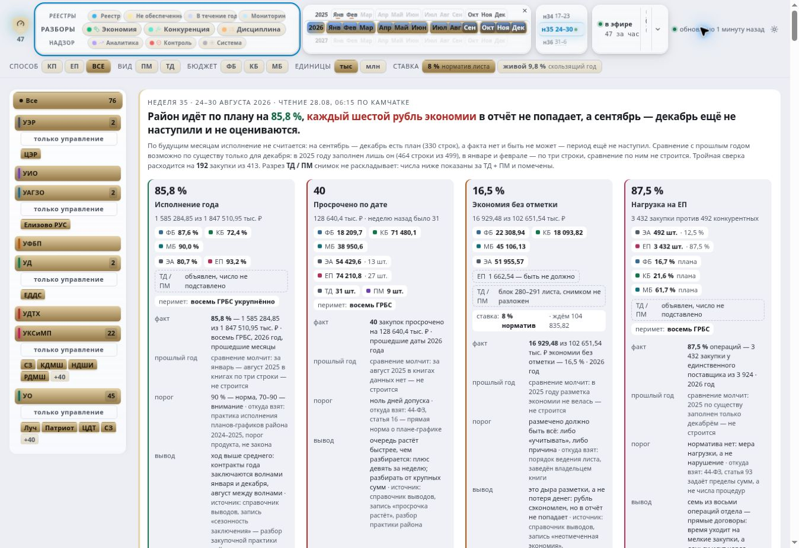

# Разбор HTML и границы уверенности

Проверена ревизия main `2461209c8d0172c4acf94f5606452c589cd4f510`, получены 67 удалённых веток и полная доступная история Git. На вершинах этих веток найдены **12 исходных дизайн-HTML; у каждого один и тот же blob во всех ветках, где файл существует**. После чтения истории найден ещё удалённый `prototype.html` из начального коммита `22d35c0`. Это 13 исходных материалов, а не 13 работающих экранов продукта.

Ещё три HTML-пути имеют другое назначение: `packages/web/index.html` — вход приложения; архивный `artifacts/Dash.html` и `prototype/index.html` — уже сохранённый, не принятый владельцем прототип Codex. Они не являются дополнительными найденными вариантами Claude. Полный перечень путей — [history-paths.json](evidence/history-paths.json), веток и blob — [branch-inventory.json](evidence/branch-inventory.json), состав каждого текущего оригинала — [html-coverage.json](evidence/html-coverage.json).

Все 13 оригиналов открыты в браузере. Разобраны смысловые разделы, подписи, модель данных, механизмы взаимодействия и ключевые правила оформления. Для небольших файлов прочитаны полные извлечённые тексты и скрипты. Для большого Pulse и выставки «Зари» дополнительно разобраны генераторы, модель, события и ограничения; декоративные SVG и каждое сочетание CSS-состояний не проверены построчно. Браузерная проверка выборочная по значимым состояниям: **это не сертификат всех размеров, доступности, анимационных кадров и комбинаций управления**. Снимок первого экрана не выдаётся за полный разбор.

## По каждому исходнику

| Исходник | Что в нём изучено и ценно | Ограничение / решение |
|---|---|---|
| [efir-uzel-schita.html](../../mockups/efir-uzel-schita.html) | Три варианта узла, состояния свежего и давно прочитанного источника; изменения, комментарии, происхождение в одном месте | Фрагмент зависит от стилей окружения, скрипта нет. Самостоятельный неоформленный вид не доказывает плохой дизайн. Берём устройство объяснения, связываем с текущим LiveHistory. |
| [ugol-varianty.html](../../mockups/ugol-varianty.html) | Все три варианта: решётка, прибор со счётом, жетоны. У Б проверены открытие, сброс и восстановление трёх условий | Б — сильнейшая механика раскрытия. Надпись «рекомендую» принадлежит автору, не означает приёмку владельцем. Обещание открытия наведением не совпадает со скриптом, который открывает кликом. Нужны фокус и явное возвращение управления. |
| [ugol-otbora-krupno.html](../../mockups/ugol-otbora-krupno.html) | Увеличенная геометрия предмета, 12 осей, подсказки, сброс, состояния чтения, тестовые кнопки | Это увеличенный стенд, не масштаб реального интерфейса. Один флаг ожидающей книги и демонстрационный счётчик событий не являются серверным контрактом. Берём форму и состояния. |
| [ugol-v-linejke-demo.html](../../mockups/ugol-v-linejke-demo.html) | Тот же предмет в линейке; проиграны уведомление, чтение без изменений, потеря связи | Сильная композиционная проверка угла. Отсутствие изменений и отсутствие связи различены. Промежуточный кадр анимации не считаем постоянным дефектом вёрстки. Механику ясного раскрытия берём из Б. |
| [otdelki.html](../../mockups/otdelki.html) | Все 24 сочетания четырёх цветов и шести материалов; три собранных направления; обработка движения блика | Это библиотека поверхностей, не набор готовых экранов. Кэнди, мат и стекло имеют разные роли. Производительность искр без профилирования не объявляется плохой или хорошей. |
| [zarya-arheologiya.html](../../mockups/zarya-arheologiya.html) | История раннего и позднего оформления, реконструкция рецепта `853548a`, градиент внутри предмета и последующий ореол | Полезно для восстановления визуальной преемственности. Авторская реконструкция не доказывает, что воспоминание владельца ошибочно. Приоритет позднему требованию живого градиента внутри. |
| [zarya-vystavka.html](../../mockups/zarya-vystavka.html) | Герой, сверка с ранним образцом, матрица 63 клеток, живой/статичный ряд, шесть отделок, стекло, три семейства по 13 вкладок, прежний ряд для сравнения и 11 направлений стиля | Здесь найдены «планеты» и автомобильные материалы. «Космос», «Камчатка», «Минералы» — альтернативы. Плашка «решение владельца» у каждой обозначает вопрос выбора, не три утверждённых решения. Контраст концов пары не равен проверке движущегося стеклянного предмета целиком. |
| [palette-and-controls.html](../../mockups/palette-and-controls.html) | Три ранние палитры, выбранное/частичное состояние, радиогруппы, фокус, возврат, пояснения периметра | Полезны взаимодействия. Ранняя рекомендация спокойной институциональной палитры не отменяет позднюю «Зарю». Живой процент в демонстрации задан числом, а не получен от сервера. |
| [2026-08-22-controls-sample.html](../2026-08-22-controls-sample.html) | Кнопки трёх иерархий, флажки/радио, частичный выбор, локальное раскрытие, переход к 47 строкам и возврат | Проверено раскрытие и обратный переход. Маленький нарисованный флажок не доказывает размер всей области нажатия. Берём семантику и поведение, внешний вид пересобираем в выбранном материале. |
| [2026-08-22-palette-sample.html](../2026-08-22-palette-sample.html) | Четыре смысловые роли, 13 цветов разделов, состояния и светлая тема | Полезно различение роли и цвета вкладки. Старый внешний ореол — исторический рецепт. Сохранить смысл тревоги и отключённого состояния при замене визуального языка. |
| [2026-08-22-design-baseline-mockup.html](../2026-08-22-design-baseline-mockup.html) | Три поколения верхней полосы, 8/13/11 вкладок, обзор, состояние данных, три вида изменений и объяснения | Предложение спрятать две группы реестра внутрь одной страницы не принято как разрешение удалить маршруты. Статические кнопки не подтверждают функциональность. Исторические счётчики и выводы не являются текущим состоянием. |
| [pulse.html](../../mockups/pulse.html) | Общая оболочка, барабаны разделов/лет/недель, отбор; рабочие очереди, витрина, объяснения; многомерная карточка и её генераторы; раздел «не сделано» | Изучен для общей системы, страница исключена из переделки. Навигационные переключатели меняют вид выбора, но не превращают HTML в 13 страниц. У многих карточек нет связи с отбором; модель долей и синтетическая история не заменяют реальные строки. Измерено переполнение длинных подписей. |
| [prototype.html из 22d35c0](https://github.com/gaben1488/dash/blob/22d35c0/prototype.html) | Первый прототип: 12 разделов, показ источников, реестр, переключение страниц; прочитаны тексты и скрипт | Историческая синяя боковая панель и статичные примеры. Сортировка меняет стрелку, не строки. Не переносить фиксированный рейтинг, вымышленные пороги и обвинительные трактовки. Нынешний дизайн из этого варианта не выводится. |

## Визуальные опоры

### Угол: сохранить предмет, сделать смысл доступным

Б соединяет узнаваемый предмет и читаемый список. В следующем варианте остаются 12 устойчивых позиций, добавляется ясное управление условиями. Общий сброс не должен срабатывать от того же неочевидного жеста, что открытие.

### Материал: у каждой поверхности своя работа

Матрица найдена и просмотрена. Из неё выбираются назначения поверхностей, а не шесть конкурирующих тем всего приложения. У принятого предмета должна быть одна согласованная физика.

### Тематические пары действительно есть в репозитории

Это исходник Claude, не новый макет Codex. Видимая часть длинных рядов ограничена шириной галереи; все 13 пар каждого семейства перечислены и разобраны в исходном генераторе. Для следующей композиции предложен «Космос», а не объявлено, что владелец его уже выбрал.

### Навигация: измеренный дефект

При ширине окна **1363 px** внутренний блок «Не обеспеченные» имеет 105 px доступной и 117 px требуемой ширины; «В течение года» — 95/103; «Мониторинг» — 84/90. Надписи не помещаются. Снимок и [измерение DOM](evidence/navigation-overflow.json) фиксируют состояние исходного HTML. Это не измерение действующего React-интерфейса: в его CSS названия уже могут переноситься, что само по себе ещё не решает продуктовую задачу компоновки.

## Что этот разбор исправляет в прежних выводах

- По репозиторию нельзя было заключать, что Claude не сохранил перечисленные владельцем идеи: планетарные семейства, отделки, угол и барабан найдены.
- «Макет хороший» не означает «расчёты верны». В Pulse есть неподтверждённые основания, фиксированные ставки и несоответствия колонок. Сохраняем полезные взаимодействия, проверяем предметную часть по коду и требованиям.
- Начальный текущий год в интерфейсе совместим с общей базой всех годов. Это разные уровни. Жёстко зашитый 2026 год в демонстрации — отдельная проблема.
- Утверждение «аналитика есть только на бэке» нуждается в пофункциональной проверке: часть июльских пробелов уже закрыта.
- 67 веток и полная доступная история закрывают проверку Git-источников этой сессии. Они не доказывают отсутствие несохранённых артефактов в личных чатах Claude или других репозиториях. Полного доступа к таким чатам этим аудитом не установлено.

## Что осталось проверить при реализации

На настоящем React-интерфейсе: сравнительные снимки до/после, адаптивность, увеличение текста, клавиатура и возвращение фокуса, обе темы, уменьшение движения, контраст всех составных состояний, сохранение прокрутки при обновлении и реальные ответы сервера. Повторно открывать неизменные исторические галереи для этого не требуется. Ни один из этих пунктов не помечен выполненным на основании скриншота HTML.
