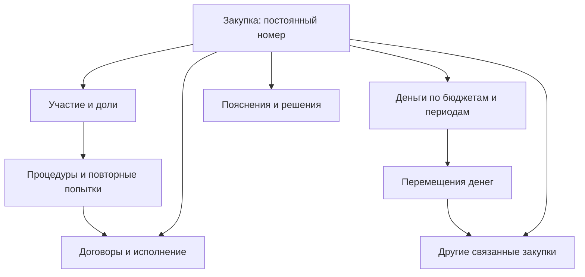
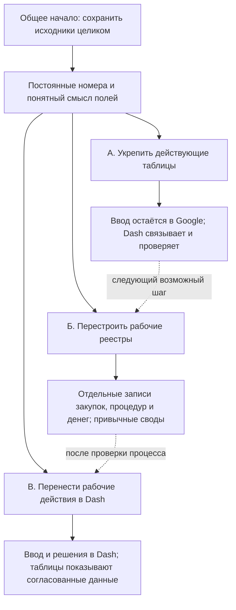

# Как могут быть устроены данные Dash

Предложение для обсуждения, а не уже утверждённая архитектура. Основано на текущих рабочих книгах, «Закупках 2.0», мониторинге и изученном коде Dash. База данных выбирается после согласования правил работы и смысла данных.

## Что полностью прочитано

Повторно прочитаны данные всех главных рабочих листов 20 известных книг. Охват — 49 листов: восемь действующих главных реестров управлений; девять главных реестров «Закупки 2.0», включая СВОД; все девять листов текущей книги процедур; все 12 листов ежедневного мониторинга 2.0; четыре аналитических/контрольных листа действующего СВОДа; семь дополнительных листов СВОДа 2.0.

Для каждой прочитанной ячейки запрошены введённое значение или формула, рассчитанное значение, отображаемый текст и примечание. Диапазоны прочитаны до границ сетки, включая заготовленные формулы в незаполненных строках. Восстановлены пропущенные при слишком большом ответе диапазоны книги процедур, разделённые на меньшие части. Незавершённых диапазонов в указанном охвате нет.

Обсуждения запрошены отдельно по всем 20 книгам, со всеми страницами, ответами и признаками закрытия/удаления. Получено 342 обсуждения: 335 неудалённых и семь удалённых записей. 251 обсуждение закрыто. Получено 254 записи ответов/действий; только три содержат текст ответа, остальные отражают действия закрытия. Удалённый текст, которого источник больше не возвращает, не восстановлен и не выдуман.

В прочитанных листах — 5 056 примечаний ячеек, из которых 4 574 начинаются с «Было:». Это встроенная в ячейки история предыдущих значений. Это не полная история документа: в ней может не быть всех изменений, а чтение текущей книги не восстанавливает автоматически её прошлые версии.

Найдены 360 996 ячеек с формулой; у 219 215 из них источник вернул непустой объект рассчитанного значения. Эти числа включают формулы-заготовки, своды и повторные представления. Они не являются числом закупок. В полученных результатах нет явных ошибок ячеек; это не доказывает правильность смысла показателей и всех расчётов.

В 335 неудалённых обсуждениях сохранена исходная привязка к диапазону, однако она представлена внутренним обозначением, а не обычным адресом вроде N43. Точное сопоставление каждого обсуждения с ячейкой и постоянной закупкой пока не подтверждено. Оно должно стать отдельным результатом перехода; совпадение процитированного значения не считается достаточным доказательством.

Не перечитывались все организационные копии листов действующих управлений и скрытые импортные копии в действующем СВОДе: они не являются дополнительными независимыми главными реестрами в этом охвате. Производные представления не суммируются с исходными реестрами. Остальные вспомогательные листы восьми отдельных книг 2.0 также не входят в эти 49 листов.

## Целевая логика

Сотрудник работает с привычной таблицей или карточкой закупки. Связанные разделы не означают, что человеку придётся заполнять девять новых файлов.

| Раздел | Что в нём находится | Как связан с остальным |
|---|---|---|
| Закупки | Постоянный номер, предмет, заказчик, управление, период, состояние потребности | Главная запись. Номер строки и привычный номер в плане сохраняются как подписи, но не определяют личность закупки |
| Процедуры и участие | Каждая попытка, её результат, предшественники/продолжения, участники и их доли | Одна закупка может участвовать в нескольких процедурах. Одна совместная процедура может включать несколько закупок/заказчиков |
| Договоры и исполнение | Подтверждённые договоры, их суммы, сроки и состояние исполнения | Несколько договоров могут относиться к одной потребности. Один договор может покрывать несколько плановых позиций; распределение не выдумывается |
| Деньги | Выделенный лимит, начальная цена, цена договора, суммы по бюджетам и периодам | У каждой суммы есть свой смысл, единица и источник. Неизвестная сумма не заменяется нулём |
| Перемещения и происхождение | Откуда и куда перевели деньги; какие закупки разделили или объединили | Связывает исходную и последующие записи. Разница цен сама по себе не доказывает экономию |
| Пояснения и обсуждения | Текст рабочих колонок, примечания ячеек, темы обсуждений с ответами и состоянием | Эти три вида текста сохраняются отдельно, с исходной привязкой. Закрытие темы не равняется согласованию |
| История и первоисточники | Что было в ячейке: введённое, формула, полный результат, видимый текст, примечание; когда это прочитано | Позволяет объяснить происхождение любой цифры и изменения. Время чтения не выдаётся за время изменения человеком |
| Поля по виду работы | Общие сведения и дополнительные поля для конкретного процесса | Новые поля могут добавляться, но для каждого определяется смысл, допустимое заполнение, ответственное место ввода и использование в сводах |
| Проверки и решения | Замечание системы, пояснение сотрудника, подтверждённое решение, основание, автор и время | Сигнал и решение — разные записи. Решения следуют за закупкой при сортировке, переименовании и смене листа |

Своды, мониторинг, экономия, конкуренция, дисциплина и остальные разделы Dash собираются из этих связанных сведений. Они являются разными представлениями общей истории. Для каждого редактируемого поля заранее определяется одно ответственное место ввода.

Все части сохраняют ссылки на первоначальные ячейки и обсуждения. Точные виды связей и обязательные поля уточняются на реальных случаях; схема не объявляет каждую существующую строку отдельной подтверждённой закупкой.

## Одна ячейка — несколько разных сведений

Реальный пример: УФБП, K4. Внутри находится формула суммы трёх бюджетных колонок. Полный результат — 24 500,2162 тыс. руб.; на экране — 24 500,22 тыс. руб. Перенос только видимого текста потерял бы часть точности. Перенос только результата потерял бы правило расчёта.

| Что сохраняем | Для чего |
|---|---|
| Введённое значение либо формулу | Знать, что человек ввёл и что вычисляется |
| Полный рассчитанный результат | Считать без потери точности из-за экранного округления |
| Видимый текст | Воспроизводить привычное представление и различать дату, деньги, текст |
| Примечание ячейки | Сохранять пояснение или записанную там историю прежних значений |
| Отдельное обсуждение | Сохранять участников, сообщения, ответы, даты, закрытие и доступную отметку удаления |

Исходная формула сохраняется как свидетельство работы таблицы. Новая система не должна автоматически выполнять произвольную старую формулу как новое правило расчёта. Правила будущего Dash согласуются отдельно. Изменяющиеся со временем формулы требуют также даты, на которую получен результат.

## Во что упираемся сейчас

| Подтверждённый случай или ограничение | Следствие для структуры |
|---|---|
| В УИО номер 72 обозначает две разные позиции; в УД также есть повторы номеров, у УЭР две содержательные строки без номера | Постоянный номер закупки нужен независимо от её места и подписи в таблице |
| В обсуждениях есть разделение одной покупки на две, выделение отдельного предмета и объединение закупок | Нужны явные связи происхождения, а не исправление старого названия без следа |
| УИО, AF49: ЭЗК287-26 не состоялась, затем размещена повторная котировка | Потребность и попытка проведения — разные вещи. История попыток не перезаписывается последним результатом |
| Совместные процедуры и разные доли уже существуют; в примечаниях 2.0 есть предупреждения, что цена одной процедуры покрывает несколько строк | Основная процедура считается один раз. Суммы участников распределяются по подтверждённым долям; неизвестные доли не назначаются автоматически |
| В части книг плановая сумма обозначает лимит, в других — цену. В 2.0 232 примечания прямо говорят о неподтверждённом переносе одного значения и в лимит, и в начальную цену | Сохранять исходную сумму и неопределённость. Отдельно подтверждать её смысл перед использованием в показателях |
| В 2.0 уже есть более осторожные случаи: 86 примечаний объясняют, почему начальная цена оставлена незаполненной | Сохранить полезное правило: отсутствие основания не заменять правдоподобной цифрой |
| УЭР, AF8/AG8 и AF16/AG16: управление просит не считать уменьшение экономией, в соседней колонке — «Не согласны, считаем экономией» | Разделить рассчитанную разницу, причину изменения и окончательное решение. Сохранить оба пояснения и основание решения |
| Главные планы используют тысячи рублей, книга процедур — рубли; видимый текст округляет полный результат | Хранить единицы и точные суммы. Приводить к общему масштабу перед сравнением |
| Примечания хранят историю, а обсуждения — ответы и закрытие. Текст рабочих колонок является ещё одним отдельным слоем | Нельзя складывать всё в одно поле «Комментарий». Нужно сохранить источник, принадлежность и разные состояния |
| Код и год процедуры могут быть спорными. В текущем мастере есть примечание о неподтверждённом исправлении ЭА366-25/ЭА366-26 | Нужен постоянный внутренний номер процедуры отдельно от исправляемого рабочего кода. Не угадывать связи по году или соседним номерам |
| В рабочем реестре уже разделены основные процедуры, доли, очереди работы и проверки закрытых процедур | Сохранить эти полезные различия. Закрытая процедура с вопросом к данным — не автоматически просроченная процедура |
| Дата публикации, ИНН или документальное подтверждение могут требовать проверки, даже если таблица пересчитывается без ошибки | Хранить происхождение и состояние подтверждения каждого существенного факта. Зелёный расчёт не подтверждает первичный документ |
| В изученном коде редактора добавленные произвольные колонки не попадают в фиксированный список записываемых полей | Новое поле должно проходить весь путь: ввод, сохранение, повторное открытие, история и применение в нужном разделе |
| В части действий Dash подтверждение сохранения может вернуться при ошибке записи; это установленный риск кода, а не доказанный случай потери данных | Подтверждение выдаётся только после фактического сохранения; ошибка остаётся видимой |
| Некоторые решения привязаны к номеру в плане, другие истории — к физической строке; текущая загрузка обсуждений Dash сохраняет количество ответов, но не полный текст каждого ответа | Единая устойчивая принадлежность записей; сохранение полного обсуждения. Обновление одного хранилища не решит это само по себе |

## Возможные планы перехода

| План | Что меняется для людей | Что остаётся трудным |
|---|---|---|
| А. Укрепить существующее | Привычные таблицы остаются; появляется надёжная связь записей, полная история, сохранение двух видов комментариев и честные сообщения об ошибках | Сложные события всё ещё трудно разместить в одной широкой строке; ограничение старой формы сохраняется |
| Б. Разделить по смыслу | Процедуры, договоры, движения денег и решения записываются отдельно, а сотрудник видит привычный свод и связанную карточку | Нужно договориться о правилах заполнения, перенести связи и проверить, где именно правят каждый факт |
| В. Сделать Dash главным рабочим местом | Карточки, действия и согласования выполняются в Dash; таблицы становятся согласованными представлениями и выгрузками | Нужно довести права, совместную работу, сохранение, историю и восстановление; две независимые правды о редактируемом поле недопустимы |

Предлагаемый старт: общее начало и улучшения плана А, затем пилот плана Б на нескольких управляемых случаях. План В — возможный последующий выбор, когда доказано, что новая структура соответствует ежедневной работе.

Пилот должен включать повторную процедуру, совместную закупку, несколько договоров, разделение/объединение потребностей, перемещение денег, переходящий период, спорную экономию, новое поле, оба вида комментариев и сохранение формулы вместе с результатом. Переход считается пригодным, если сохраняются суммы, смысл, связи, история и ручные решения, а сотрудники могут выполнить свои обычные действия.

## Список источников и границ чтения

Точный перечень книг, листов, диапазонов и подсчётов приложен в доказательный архив: `rich/coverage-plan.json`, `rich/profile.json`, `rich/comments.json` и полные ответы чтения ячеек. Это результаты чтения в течение исследования 10.10.2026, а не одновременный снимок всех изменяемых документов.

Главные источники: УЭР, УИО, УАГЗО, УФБП, УД, УДТХ, УКСиМП, УО; действующий «Рабочий реестр процедур» и его рабочие/контрольные представления; действующий СВОД; девять книг «Закупки 2.0»; «Ежедневный мониторинг 2.0». Архитектурные выводы относятся ко всему Dash, включая просмотр, редактирование, контроль качества, мониторинг, ручные решения, историю и настройки.
