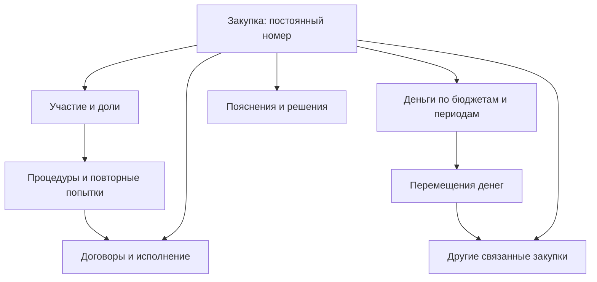
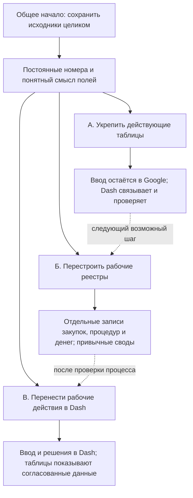

# Dash: передача аудита данных, сигналов и визуальных концептов

Дата: 10.10.2026. Код проверен на `2461209c8d0172c4acf94f5606452c589cd4f510`.

Это независимый аудит всего Dash. Пользователь пока не выбрал конечную архитектуру. MongoDB, PostgreSQL + JSONB, перенос работы из Sheets в Dash и перенос макетов в Figma — варианты обсуждения, а не утверждённые задачи реализации. Генератор отчётов — один из потребителей.

**Следующему Codex / Claude:** сначала прочитать эту задачу полностью, затем `AGENTS.md` и актуальные изменения относительно baseline. Не начинать новый общий аудит с нуля. В конце задачи встроены полные ранее подготовленные документы: аудит архитектуры, независимый workflow, человеческая схема данных с таблицами и графом вариантов.

## Что установлено при проверке сигналов

Предупреждения о номерах содержат и настоящие совпадения, и ошибки самой проверки. Нельзя массово перенумеровывать листы по нынешнему предупреждению.

| Случай | Что показывает проверка | Что действительно найдено |
|---|---|---|
| Пустой хвост с формулами | Требует номера для строк без закупки | **5 565 лишних позиций** в сообщениях о пропущенном A: УФБП 929, УАГЗО 920, УДТХ 897, УИО 919, УО 967, УЭР 933. Это позиции внутри семи сообщений по листам, не 5 565 отдельных карточек предупреждений |
| Составные номера | `173`, `173/1`, `173/18` считаются одинаковыми | Денежный `toNumber()` использует `parseFloat`, поэтому отбрасывает часть после `/`. Аналогично `121/1` превращается в 121. Для идентификатора это неверно |
| Настоящие одинаковые метки | Часть предупреждений обоснована | УИО №72: строки 53, 73. УД: №174 — 155/156; 175 — 157/158; 176 — 159/160; 178 — 162/163; 179 — 164/165; 180 — 166/167; 181 — 168/169; 182 — 170/223; 183 — 171/224; `173/18` — 203/204. Итого 11 групп точных повторов исходного A. Это дефекты уникальности метки, не доказательство двойного расходования |
| Настоящие отсутствующие номера | Смешаны с пустым хвостом | УЭР, строки 80 и 81: заполненные рабочие позиции без A |
| Номера выглядят датами | Сообщение УД перечисляет «46 080 пропусков» | В A174 видимый текст `23/1`, сохранённое числовое значение 46045; в A175 `24/1` и 46046. Число даты ошибочно участвует в диапазоне нумерации. Это потеря смысла представления при проверке, а не десятки тысяч удалённых закупок |
| Повтор кода основной процедуры | Отдельная проверка реестра | В текущем мастере разобраны **442 основные процедуры**, повторов их кодов не найдено; **6 долей участников** учитываются отдельно |
| Одна процедура у нескольких строк плана | Сигнал утверждает «копия строки либо ошибка в номере» | Найдено 6 неоднозначных связок. Повтор ссылки требует разбора предмета, заказчика, разделения потребности и долей. Сам по себе повтор не доказывает копию. Не выбирать строку по ближайшей сумме |

Причина ложного пустого хвоста: `classifyRows` относит строки с нулевыми результатами формул к `service`; `row_numbering` считает весь `service` нумеруемым. Номер нужен реальному объекту, а не заготовке формулы. Исправлять предикат применимости проверки; не переименовывать все служебные строки ради одного сигнала.

Исходные адреса относятся к снимку 10.10.2026. Строки движутся. Например, сохранённый текст AH УО ссылается на строку 1837, а текущая связка ЭА36-26 обнаружена на 1836. Устаревающий адрес комментария — дополнительное свидетельство необходимости постоянного внутреннего идентификатора.

## Проверка помимо номеров

Выполнен воспроизводимый локальный запуск **реальных функций production-кода**, а не переписанных аналогов: `classifyRows`, `validateData` с 22 правилами, `detectSignals`, общее подавление сигналов по классу строки, `parseMonitoringProcedures`, переходники книг и процедур, `matchMonitoring`. Чтение формул, результатов, отображения и примечаний использовало ранее полученные полные сетки.

Запуск использовал Node 24 `stripTypeScriptTypes` и подстановку workspace-импорта `@aemr/shared`. Из barrel исключён только неиспользуемый экспорт Zod-схем из-за отсутствия зависимости. Сами проверяемые функции не изменялись. Это **не** полный запуск сервера, конвейера или установленного приложения и **не** доказательство точного количества карточек на текущем экране.

| Область | Результат и границы вывода |
|---|---|
| Сверка планов с текущим мастером процедур | 335 сопоставленных строк; 7 кодов только в книгах; 94 процедуры без найденной строки; 6 неоднозначных кодов внутри книги; 4 ячейки со списком процедур. Это результаты связки, не автоматически 107 ошибок данных |
| Сверка сумм сопоставленных строк | Начальная цена: 302 совпадения, 33 расхождения. Факт: 321 совпадение, 11 расхождений, 3 случая без возможности сравнить. Единицы приведены из тысяч рублей в рубли. Плановый лимит и начальная цена могут различаться по смыслу |
| Шесть неоднозначных кодов | ЭА138-26 — УДТХ 13/64; ЭА23-26 — УО 4/1004; ЭА36-26 — УО 36/1836; ЭА25-26 — УО 75/1871; ЭА26-26 — УО 77/1872; ЭА101-26 — УО 1094/1101. Сохранять вопрос до подтверждения распределения или ошибочного копирования |
| Неверный профиль колонок | При передаче «СВОД с месяцами» в `validateData` воспроизводится 201 претензия `budget_sum_plan`: правило проверяет K=H+I+J, хотя шапка задаёт J=G+H+I, а K — уже факт ФБ. `scope='both'` обходит защиту для `shdyu_monthly`. Проверить, включается ли этот лист в конкретный runtime-снимок, прежде чем называть число текущими экранными ошибками |
| Другой свод | На «СВОД ТД-ПМ» общий набор также порождает претензии сумм и процентов. Нужна проверка участков/шапок и профиль правил свода; не исправлять суммы по формуле чужого реестра |
| Дата и год плана | В УО 499 кандидатов `planYearMissing`; примеры имеют N=`X` и пустой P. Это неполные сведения о сроке/годе. Вывод «финансирования нет» требует отдельного основания; не подменять его пустой датой |
| Экономия | Общая официальная экономия по-прежнему только Z+AA+AB при AD=`да`. Предупреждение о большой разнице/экономии и итоговый официальный показатель — разные вещи. Спор между ГРБС и УЭР хранить с обеими позициями и решением |
| Ошибки самих правил | На прочитанном наборе исключений не получено. В коде остаётся риск: `validateData` и `detectSheetSignals` ловят исключение и молча продолжают. Не выдавать такой результат за успешную полную проверку |
| Формулы и комментарии | Проверка, основанная только на значениях, не доказывает целостность формулы. Полный снимок должен сохранять формулу, точный результат и видимый текст. Примечание ячейки, текстовая рабочая колонка и обсуждение с ответами/закрытием — три разных слоя |

## Порядок следующей работы

1. **Исправить достоверность проверки нумерации через тесты:** пустой формульный хвост молчит; реальная строка без A сигналит; `173`, `173/1`, `173/18` различаются; два `173/18` совпадают; форматированное `23/1` не создаёт 46 тысяч пропусков. Проверить всех потребителей номера и не применять исправление денежного парсера к деньгам.
2. **Развести «повтор метки», «повтор ссылки» и «копию объекта».** Переформулировать недоказанный диагноз в запрос сверки. Для 6 связок установить доли или причину повтора; не распределять суммы автоматически и не удалять строки.
3. **Ограничить правила профилем данных:** свод, месячный свод, план ГРБС и процедура не имеют одинаковой раскладки. Тест должен проверять настоящий вызов `validateData`, не только отдельную формулу.
4. **Согласовать устойчивую идентичность и сохраняемые расширения первого процесса.** A — полезная рабочая метка, но сейчас не уникальный постоянный внутренний ключ. Проверить путь нового поля: ввод → сервер → сохранение → повторное открытие → история → нужные проверки/поиск.
5. **Согласовать модель и рабочий процесс, затем хранилище.** Сравнение БД провести на одинаковых действиях Dash. Не делать миграцию главным способом исправления ложных сигналов.
6. Перед кодовыми коммитами выполнять `pnpm -r tsc --noEmit && pnpm -r test`, следовать AGENTS и Superpowers TDD. Здесь этот полный гейт не выполнен: клонирование через доступный git-прокси не прошло авторизацию; прочитан закреплённый код через GitHub. Продуктовые файлы и живые таблицы не менялись. Эта задача сохраняет результаты исследования без коммита, нарушающего гейт.

## Доступные макеты и статус решений

Все ниже — реальные файлы закреплённого репозитория. Статусы взяты из README макетов и письменной обратной связи владельца; это не заявление о новом визуальном тестировании каждого экрана в браузере. Сохранённые только в закрытых артефактах Claude версии автоматически не доступны.

| Макет / материал | Что полезно перенести в дальнейшую работу | Что требует осторожности |
|---|---|---|
| `docs/superpowers/mockups/pulse.html` | Концепция «Пульса», подробные состояния, информационные блоки | Живой большой макет с соседними экспериментами; весь файл не равен утверждённому интерфейсу. Проверять реальные события, общие фильтры, отсутствие ложного «всё спокойно» |
| `efir-uzel-schita.html` | Отдельный образец верхнего «эфира» и узла щита | Фрагмент, а не полная страница и не универсальное правило всех экранов |
| `ugol-otbora-krupno.html`, `ugol-v-linejke-demo.html`, `ugol-varianty.html` | Угол отбора, счётчик и состояния, три альтернативы A/B/C | Выбор A/B/C ещё ожидает решения владельца. Рекомендованный в анализе B не считать утверждённым |
| `otdelki.html` | Шесть отделок и сравнение состояний | Применять по матрице элемента и состояния, а не менять одним цветом всё приложение |
| `zarya-arheologiya.html` | Восстановление исторической «Зари», полезный исходный образец | Историческая реконструкция; не автоматическое разрешение вернуть весь старый стиль |
| `zarya-vystavka.html` | Галерея вариантов для сравнения | Варианты не равны принятым продуктовым решениям |
| `palette-and-controls.html` | Старый образец палитры и органов управления | Кандидат на удаление в README; прежний лазурный halo отвергнут поздней обратной связью |
| `docs/superpowers/audits/2026-08-22-design-baseline-mockup.html` и образцы controls/palette той же даты | История решений и роли цвета/управления | Датированный baseline, поздние §20–21.1 заменяют часть решений о свечении и вкладках |
| `docs/superpowers/specs/2026-08-22-pulse-feedback-2.md` | Основной журнал замечаний владельца, включая изменения решений | Более позднее решение имеет приоритет. §21.1 отменяет обязательность общего горизонта |
| `2026-08-29-zarya-matrica.md`, `2026-08-29-ugol-otbora-analiz.md` в specs | Матрица элемент × состояние × отделка; разбор угла отбора | Матрица и рекомендации должны оставаться связанными с конкретными принятыми решениями |

При дальнейшем переносе в Figma полезно сначала выбрать действующие решения и составить страницы/компоненты/состояния. Сохранить счётчики отбора, происхождение цифр, различие «нет данных» и «срок ещё не наступил», общий контекст фильтров и фактические события. Финальный Figma-файл не создан; платные действия и подписка не требовались для этого аудита. Желание продолжить дизайн в Figma — контекст следующего этапа, не основание перестраивать модель данных.

## Источники и полнота

Ранее полностью прочитаны главные рабочие листы и согласованные вспомогательные листы **20 книг / 49 листов**, включая старые «Закупки 2.0», нынешние планы, мастер процедур и своды. Покрытие — не все случайные исторические вкладки. Прочитано 342 обсуждения, включая 7 удалённых, и 5 056 примечаний. У обсуждений сохранены ответы/закрытие в исходном чтении; это не означает, что текущий загрузчик Dash сохраняет полный текст ответов.

Снимки прочитаны последовательно 10.10.2026, не в одной атомарной транзакции. Не загружать в публичный репозиторий полные сырые таблицы с авторами и перепиской. Для повторения запросить свежие сетки с теми же исходными ссылками и закрепить момент чтения.

Ключевые пути для воспроизведения:

- `packages/shared/src/rule-book.ts`: `rowNumbering`, `toNumber`, общие бюджетные проверки.
- `packages/core/src/pipeline/classify.ts`, `validate.ts`, `signals.ts`, `orchestrator.ts`.
- `packages/core/src/monitoring/procedures.ts`, `cross-check.ts`, `signals.ts`.
- `packages/core/src/pipeline/monitoring-match.ts`.
- Реестр визуальных файлов: `docs/superpowers/mockups/README.md`; решения: `docs/superpowers/specs/2026-08-22-pulse-feedback-2.md`.

Ниже сохранены полные материалы предыдущего этапа. Упомянутые в них имена трёх подготовленных Markdown-файлов соответствуют следующим трём встроенным разделам; отдельные файлы в ветке этим исследованием не создавались. Для перехода к реализации их можно перенести в `docs/superpowers` отдельным документационным коммитом после обязательного гейта.

---

## Полный аудит архитектуры Dash

# Dash целиком: независимый архитектурный аудит и бриф для Superpowers
Дата: 10.10.2026. Часовой пояс рабочих периодов: Asia/Kamchatka.
Статус: исследование и сравнение вариантов; целевая архитектура не утверждена.

## 1. Исправленная постановка задачи

Предмет исследования — весь Dash: рабочий реестр, редактирование, мониторинг процедур, контроль, аналитика, история, комментарии, источники, настройки и отчёты как один из потребителей данных.

Предыдущий проход слишком сильно опирался на генератор отчётов. Проверенные сведения о коде и источниках сохраняют пользу, но устройство генератора не может определять всю архитектуру приложения. Этот документ заменяет прежнюю версию аудита и исправляет масштаб исследования.

Из конкретного чата «MongoDB цели и применение» восстановлены аргументы пользователя:

- у разных ГРБС различается специфика таблиц и процессов;
- единообразное расширение и изменение общей схемы может оказаться неудобным;
- текстовые поля одновременно содержат этапы, пояснения и сведения других видов;
- конечная архитектура ещё определяется;
- требуется отдельный независимый workflow аудита и Superpowers.

Это требования к изменчивости модели и работе приложения. Количество строк и одинаковые заголовки исходных книг не опровергают эти требования.

**Скорректированный вывод:** документная модель — обоснованное направление для Dash. MongoDB следует рассматривать как полноценного кандидата. PostgreSQL + JSONB способен реализовать альтернативную модель с расширениями. До выбора нужно проследить, как новые поля и разные процессы проходят через редактор, API, сохранение, поиск, проверки и аналитические представления.

## 2. Superpowers: фактическое состояние

Проверка плагина в этой сессии вернула:

- Superpowers установлен: installed = true;
- включён: status = ENABLED;
- предыдущее предложение установки принято.

Прочитаны и применяются навыки using-superpowers и brainstorming, а также адаптация для Codex. Задача классифицирована как архитектурная.

Выполнены исследование контекста, восстановление намерения, разбор вариантов и подготовка этого брифа. Полная спецификация ещё не согласована. Навык writing-plans и реализация не запускались.

Brainstorming требует обсуждения архитектурного дизайна, проверки письменной спецификации пользователем и затем перехода к плану реализации. Это относится к будущей реализации; не препятствует уже разрешённому исследованию приложения.

## 3. Что исследовано

Закреплённый baseline кода: gaben1488/dash, main = 2461209c8d0172c4acf94f5606452c589cd4f510. Main повторно проверен в этой сессии и остался на этом commit.

Всего отобрано 70 уникальных файлов кода и документации, включая 36 дополнительных файлов при расширении исследования. У больших страниц и модулей исследованы относящиеся к задаче участки и вызывающие пути; это не утверждение о построчном аудите всего репозитория.

Дополнительно к прежним источникам изучены:

- регистрация серверных маршрутов и навигация приложения;
- клиентский API и общий store;
- редактор реестра и его фактический механизм сохранения;
- жизненный цикл замечаний и запись истории;
- ручная разметка «в течение года»;
- текстовые аннотации и комментарии Drive;
- мониторинг, разбор процедур и связывание с плановыми строками;
- история строки, журналы и происхождение данных;
- SSE-уведомления, кэши и чтение основных реестров;
- фиксированные DTO, схемы и карта смысла плановых сумм по ГРБС.

Данные прежнего прохода: восемь действующих реестров ГРБС, рабочий реестр процедур и исторический прототип «Закупки 2.0». Структурный профиль включал 4 092 строки всех лет по правилу заполненных B и G. Это не официальный отчётный показатель.

Не проверены runtime-БД, фактическая production-версия, эксплуатационная нагрузка, параллельные пользовательские сессии и восстановление серверных резервных копий. Приложение в этой сессии не запускалось. Наблюдения ниже относятся к исследованному коду, а не к доказанным инцидентам.

## 4. Карта всего Dash

| Контур | Что делает | Опорные данные и состояние |
|---|---|---|
| Пульт и свод | Сводные числа, отборы, переход к деталям | Снимки, официальные и рассчитанные метрики, состояние источников |
| Реестр | Просмотр, поиск, отбор по ГРБС/учреждению/периоду, редактирование | Строки книг ГРБС; правки возвращаются в Sheets |
| Специальные корзины | Не обеспеченные финансированием; закупки в течение года | Предикаты над строками; для видов «в течение года» есть ручные переопределения |
| Мониторинг | Рабочие процедуры, связи, участники, поставщики, собственная аналитика и сверка | Отдельная книга процедур и её разбор, отдельный кэш |
| Экономия, конкуренция, дисциплина, аналитика | Несколько представлений одних фактов с разными правилами отбора | Общие словари и правила, серверные и клиентские вычисления |
| Контроль | Сверка, качество заполнения, замечания, рекомендации, журнал, дополнительные секции | Автоматические проверки плюс решения и история человека |
| Комментарии и происхождение | Исходный текст, аннотации несогласованности, след правок и история строки | Поля книг, журналы, снимки, комментарии Drive, адреса источников |
| Источники и настройки | Подключение, проверка, обновление, настройка привязок метрик | Конфигурация, приватные файлы, SQLite-переопределения |
| Живые обновления | Оповещение экрана об изменениях и повторное чтение | Webhook/очередь, шина событий, SSE, клиентские состояния |
| Отчёты | Фиксированные выпуски и Word-представления | Отдельный отчётный контур; потребляет факты и рекомендации |

Вывод из карты: Dash уже совмещает чтение данных, рабочие действия и контроль. Его нельзя оценивать только как оболочку для отчёта или как набор документов.

## 5. Проверенные ограничения нынешней конструкции

### 5.1. Новый столбец интерфейса ещё не становится сохраняемым полем

В DataBrowser есть handleEditorAddColumn: он добавляет колонку в состояние editorColumns. Однако handleEditorSaveRow перебирает только фиксированный FIELD_TO_COL:

- subject → G;
- method → L;
- planFB/KB/MB → H/I/J;
- factFB/KB/MB → V/W/X;
- planDate/factDate → N/Q;
- flag → AD;
- commentGRBS → AF.

Поле, отсутствующее в этой карте, не входит в changes и не отправляется на сохранение данным обработчиком.

Таким образом, наличие настройки колонок в UI не обеспечивает расширяемую модель данных. Подмена SQLite на MongoDB не изменит этот путь автоматически: понадобится новый контракт редактора и API.

### 5.2. Представление строк привязано к заранее известной форме

RowDto собирается из фиксированных индексов DEPT_COLUMNS. Комментарии ГРБС, УЭР и УФБП представлены отдельными заранее заданными свойствами. Денежные значения и даты также идут по фиксированному набору полей.

В shared существуют типы и схемы, а основной pipeline имеет отдельные правила классификации и пересчёта для ГРБС и свода. Это полезный существующий контракт, но не готовая поддержка произвольных профилей данных.

Нужна эволюция от «одна строка известных колонок» к «объект известного типа и версии с расширениями», при сохранении совместимого представления для текущих экранов.

### 5.3. Различия ГРБС уже частично признаны, но записаны в коде

plan-semantics.ts содержит разные виды смысла плановой суммы и уровень уверенности для каждого ГРБС. Источник карты — исторические слова владельца от 18.08.

Это подтверждает существование различий внутри одинакового формата. Однако статическая настройка управления не обеспечивает произвольные исключения по записи, истории смысла и развития схем.

### 5.4. В разных частях Dash разные правила идентичности

| Место | Текущий ключ | Ограничение |
|---|---|---|
| Редактор и маршруты правки | ГРБС + физическая строка листа | Вставка/перестановка строк меняет адрес |
| Разметка «в течение года» | ГРБС + № п/п | Пустой номер запрещён; повторяющийся номер не различает объекты |
| Замечания pipeline | Хеш ряда признаков, включая предмет и плановую сумму | Изменение этих признаков меняет ключ; связь человеческого решения со следующим наблюдением требует проверки |
| Таймлайн | Строка листа для журнала/SQL плюс признаки содержимого для недельных срезов | Разные способы сопоставления внутри одной истории |
| Отчётный контур | Собственный постоянный UID и mapping | Это ещё не единая идентичность оперативного Dash |

В живых значениях уже найдены заполненные позиции без номера и разные позиции с одинаковым номером. Поэтому нужно согласовать идентичность на уровне приложения. Не следует просто переносить UID из отчётного механизма и считать задачу решённой: требуется мост ко всем рабочим объектам и историям.

### 5.5. Источник записи зависит от действия

- Правка строки отправляется в Google Sheets.
- Статус замечания и история сохраняются в SQLite.
- Вид закупки «в течение года» хранится как SQLite-overlay.
- Рекомендации имеют собственный действующий реестр.
- Настройки источников и часть операционного состояния живут в файлах.
- Комментарии Drive читаются и сохраняются отдельно.
- Пользовательские отборы и состояния экрана живут на клиенте.

Это допустимый результат постепенного развития, но «перенести БД Dash» не означает перенести один файл. Нужно определить авторитетный источник каждого класса данных и границы операций.

### 5.6. Гарантии сохранения неодинаковы

В маршруте статусов замечаний изменение и история уже записываются транзакционно, ошибки дают отказ. Это механизм, который стоит сохранить.

В исследованном маршруте изменения mapping ошибку записи переопределения можно залогировать, после чего вернуть success: true. В разметке «в течение года» основная запись и аудит раздельны. Правка Sheets и её серверный аудит также раздельны.

Это конкретные различия контрактов, требующие проверки и унификации при будущей реализации. Они не доказывают произошедшую потерю данных.

### 5.7. Текстовые поля и обсуждения — разные источники

Помимо AF/AG/AH есть комментарии Drive с ID, автором, текстом, цитатой, признаками удаления/разрешения и числом ответов. Исследованное чтение не сохраняет полный текст ответов как самостоятельную историю и не доказывает адрес ячейки по одной цитате.

Аннотации «комментарий против структуры» — вычисленные проверки согласованности, а не официальные статусы. Их нельзя смешивать с самим человеческим текстом и с жизненным циклом замечания.

### 5.8. Сохранность полей проверяется не только БД

В клиентском API уже есть сознательное сохранение исходного JSON после проверки: комментарий отмечает, что strip-поведение схемы могло вырезать незадекларированные свойства.

Значит, для расширений нужно проверить весь путь, включая валидаторы, сериализацию, обновление и клиентскую форму. БД может сохранить поле, которое следующий слой молча потеряет.

## 6. Что должно быть гибким

Не предлагается одна обязательная закупочная форма на все ГРБС. Разделять следует три вида различий:

1. **Форма данных:** дополнительные поля, повторяющиеся группы, состав реквизитов.
2. **Процесс:** стадии, допустимые действия, ответственность, события и исключения.
3. **Смысл:** единицы, назначение суммы, период и происхождение утверждения.

Общая оболочка объекта минимальна: устойчивый ID, тип, ГРБС/организация при применимости, ревизия, версия модели и происхождение. Остальные атрибуты принадлежат конкретному типу/профилю. Обязательность поля определяется операцией и профилем, а не желанием заполнить всё.

Профиль нужен только там, где подтверждена разница. Не следует сразу строить универсальный визуальный конструктор процессов или делать отдельную коллекцию/таблицу для каждого управления.

Один ГРБС может иметь несколько процессов. Два ГРБС могут использовать одинаковый процесс. Поэтому основное основание профиля — тип работы, а ГРБС может задавать настройку или исключение.

## 7. Как разбирать смешанный текст

Для первого этапа:

- исходный текст сохраняется неизменным вместе с источником;
- новая запись может отдельно указывать тип: объяснение, обещание действия, наблюдение о процедуре, позиция по экономии, обоснование;
- один старый текст может ссылаться на несколько типов информации;
- извлечённые утверждения имеют ссылку на фрагмент и версию интерпретации;
- неустановленный автор или смысл остаётся неизвестным;
- структурный факт, мнение участника и предложение алгоритма не становятся одним статусом.

AI-разбор можно рассматривать как вспомогательную функцию поиска и предложения структуры. Чтобы исправить архитектуру, не требуется сначала вручную классифицировать всю историю или заставить сотрудников повторно подтвердить каждый старый комментарий.

## 8. Три архитектурных подхода для всего приложения

| Подход | Где сильнее | Главная цена |
|---|---|---|
| Эволюция текущего Dash, пока с SQLite | Позволяет сначала изменить идентичность, контракты и профили, не меняя одновременно всю эксплуатацию | Ограничения серверной записи и будущей нагрузки остаются предметом проверки |
| Документное ядро на MongoDB | Подходит развивающимся документам разных форм, карточкам и локальным изменениям агрегата | Придётся проектировать межобъектные связи, индексы, общие выборки, историю и проверки целостности |
| PostgreSQL с JSONB-расширениями | Подходит сочетанию связанных объектов, финансовых фактов, аналитики и гибких атрибутов | Потребуются ясные границы между структурированными связями и расширениями; полная схема в JSONB не станет автоматически удобной |

В MongoDB документы одной коллекции могут иметь разные поля; документирован подход с разными schemaVersion. Это непосредственно относится к аргументу пользователя. Однако приложение всё равно должно понимать старую и новую формы; запросы и индексы могут нуждаться в изменении.

PostgreSQL позволяет хранить JSONB наряду с реляционными полями. Если почти всё превратить в один JSONB-документ, часть преимуществ явных связей и ограничений потребуется восстанавливать в прикладном коде.

**Моя рекомендация на этом этапе:** принять документно-расширяемую модель как кандидат для приложения и сравнить MongoDB с PostgreSQL + JSONB на одинаковых операциях Dash. SQLite можно оставить на время этой работы. Прежнее преимущественное предпочтение PostgreSQL было слишком тесно связано с найденными отчётными и финансовыми связями; это недостаточное обоснование выбора для всего продукта.

Размер в несколько тысяч строк не является самостоятельным аргументом ни за MongoDB, ни против него. Проблема пользователя относится к изменчивости и рабочим действиям.

## 9. Независимый workflow всего Dash

Подробности — в обновлённом PROCUREMENT_WORKFLOW_2026-10-10.md.

1. Исследовать контекст и восстановить требования — выполнено.
2. Описать реальные операции, источники записи и отличия профилей — первая карта готова.
3. Через Superpowers brainstorming обсудить варианты и оформить согласованную спецификацию первого архитектурного среза.
4. После проверки спецификации — writing-plans: небольшой план изменений с критерием завершения.
5. Проверить расширяемость на полном пути: новое поле только одного профиля → ввод → сохранение → повторная загрузка → поиск → контроль → аналитика.
6. Отдельно проверить идентичность и сохранность решений при перемещении строки и изменении суммы/предмета.
7. После результатов выбрать физическое хранилище и состав переноса.
8. Переносить по рабочим потокам с одним источником записи и восстановлением новых изменений при откате.

Генератор отчётов участвует в проверке совместимости как один из потребителей. Его Word-выходы не являются главным критерием успеха всей миграции.

## 10. Первый срез и критерии успеха

Предлагаемый первый срез — **устойчивый объект реестра и сохраняемые расширения одного процесса**, с совместимостью текущих экранов. Это предложение для обсуждения, не разрешение реализации.

Успех означает:

- поле добавляется одному профилю, а остальные не получают лишнюю обязательную колонку;
- старые записи продолжают читаться без массового фиктивного заполнения;
- новая версия модели не удаляет незнакомые ей исходные сведения;
- повторное открытие и поиск показывают сохранённое поле;
- ручная классификация и решение по замечанию остаются у того же объекта;
- две конкурентные правки не дают молчаливую потерю;
- показатели имеют одинаковый смысл, независимо от физической БД;
- работающие разделы Dash сохраняют свои контракты.

Вопрос, который сильнее всего влияет на последующий дизайн: станет ли Dash основным местом ввода, или книги останутся рабочим источником на длительное время. До ответа рабочее предположение — постепенный переход по отдельным операциям с совместимостью Sheets; это не утверждённая конечная архитектура.

## 11. Источники

Полный перечень 70 выбранных файлов и их контрольные суммы — в code-source-register.json доказательного архива.

Ключевые файлы на закреплённом commit:

- [Состав серверных маршрутов](https://github.com/gaben1488/dash/blob/2461209c8d0172c4acf94f5606452c589cd4f510/packages/server/src/app.ts).
- [Навигация приложения](https://github.com/gaben1488/dash/blob/2461209c8d0172c4acf94f5606452c589cd4f510/packages/web/src/App.tsx).
- [Редактор реестра](https://github.com/gaben1488/dash/blob/2461209c8d0172c4acf94f5606452c589cd4f510/packages/web/src/pages/DataBrowser.tsx).
- [Клиентский API](https://github.com/gaben1488/dash/blob/2461209c8d0172c4acf94f5606452c589cd4f510/packages/web/src/api.ts).
- [DTO строки](https://github.com/gaben1488/dash/blob/2461209c8d0172c4acf94f5606452c589cd4f510/packages/server/src/services/rows-dto.ts).
- [Ручная разметка](https://github.com/gaben1488/dash/blob/2461209c8d0172c4acf94f5606452c589cd4f510/packages/server/src/routes/annotations.ts).
- [Жизненный цикл замечаний](https://github.com/gaben1488/dash/blob/2461209c8d0172c4acf94f5606452c589cd4f510/packages/server/src/routes/issues.ts).
- [Идентичность замечаний](https://github.com/gaben1488/dash/blob/2461209c8d0172c4acf94f5606452c589cd4f510/packages/core/src/pipeline/issue-identity.ts).
- [История строки](https://github.com/gaben1488/dash/blob/2461209c8d0172c4acf94f5606452c589cd4f510/packages/server/src/routes/timeline.ts).
- [Комментарии Drive](https://github.com/gaben1488/dash/blob/2461209c8d0172c4acf94f5606452c589cd4f510/packages/server/src/services/drive-comments.ts).
- [Привязки метрик](https://github.com/gaben1488/dash/blob/2461209c8d0172c4acf94f5606452c589cd4f510/packages/server/src/routes/mapping.ts).
- [Смысл плановых сумм](https://github.com/gaben1488/dash/blob/2461209c8d0172c4acf94f5606452c589cd4f510/packages/shared/src/plan-semantics.ts).

Техническая документация, проверенная 10.10.2026:

- [MongoDB: Data Modeling](https://www.mongodb.com/docs/manual/data-modeling/).
- [MongoDB: Schema Versioning](https://www.mongodb.com/docs/manual/data-modeling/design-patterns/data-versioning/schema-versioning/).
- [PostgreSQL: JSON Types](https://www.postgresql.org/docs/current/datatype-json.html).

Доказательный архив сохраняет прежние выборки восьми книг и 2.0. Они являются подтверждениями конкретных исходных случаев, а не единственной моделью будущего Dash.

## Дополнение: полное расширенное чтение рабочих листов

10.10.2026 дополнительно прочитаны главные рабочие листы всех 20 известных книг и связанные рабочие/контрольные листы: всего 49 листов. Получены формулы, исходные значения, полные результаты, отображаемый текст и примечания. Обсуждения прочитаны отдельно по всем книгам, со всеми страницами и ответами: 342 темы, включая семь удалённых записей; 254 ответа/действия, из них три текстовых ответа. В ячейках — 5 056 примечаний, в том числе 4 574 записей, начинающихся с «Было:». Число формул и примечаний включает производные своды и заготовленные строки и не является числом закупок.

Новые доказательства: примечания ячеек прямо фиксируют неопределённость смысла плановых сумм; обсуждения показывают разделение и объединение закупок, перенос средств и изменения объёма. В текущей книге процедур уже есть полезные различия основных процедур/долей, отдельных рабочих очередей и проверки закрытых процедур, которые нужно сохранить. Нулевое число явных ошибок формул не доказывает подтверждение первичных фактов.

Точная адресная принадлежность обсуждений ещё требует восстановления: исходные обозначения диапазонов сохранены, но это не обычные адреса ячеек. Тексты удалённых сообщений, не возвращаемые источником, не восстановлены. Полное описание охвата, понятная целевая схема и граф вариантов перехода — в `DASH_DATA_STRUCTURE_RU_2026-10-10.md`. Новые ответы источников и подсчёты — в `audit-evidence/rich/`.

---

## Независимый workflow

# Независимый workflow архитектуры Dash
Дата: 10.10.2026. Масштаб: приложение целиком.
Статус: Superpowers установлен и включён; brainstorming начат.

## 1. Назначение

Выбрать способ развития Dash, при котором разные процессы ГРБС могут иметь разные наборы полей и развиваться без переделки всего приложения.

Включены реестр и ввод, мониторинг, контроль, человеческие решения, комментарии, поиск, аналитика, источники, история и обновления. Генератор отчётов — один из потребителей данных.

Предыдущая версия workflow слишком сильно опиралась на отчётность. Эта версия заменяет её. Исторические концепты «Закупки 2.0» и прежние предложения ассистента не считаются утверждённой архитектурой.

## 2. Как применяется Superpowers

Проверено: Superpowers установлен и ENABLED. Прочитаны using-superpowers, brainstorming и адаптация для Codex. Задача классифицирована как архитектурная.

На текущем этапе выполнены исследование контекста, восстановление цели из чата MongoDB, карта приложения и сравнение подходов. Результат — исследовательский бриф в PROCUREMENT_ARCHITECTURE_AUDIT_2026-10-10.md.

Последовательность установленного brainstorming:

1. Понять цель и ограничения.
2. Исследовать существующие потоки.
3. Обсудить 2–3 подхода и дизайн.
4. Написать и проверить согласованную спецификацию.
5. Получить отзыв пользователя по письменной спецификации.
6. Перейти к writing-plans.
7. После просмотра плана и выбора способа выполнения — реализация.

Исследовательский бриф не является уже утверждённой спецификацией. writing-plans, реализация и миграция в этой сессии не выполнялись.

## 3. Этапы и конечные результаты

| Этап | Статус | Результат |
|---|---|---|
| D0. Восстановить намерение | Выполнен | Различия процессов ГРБС, изменчивые поля, смешанный текст, неопределённая конечная архитектура |
| D1. Разобрать нынешний Dash | Выполнен на уровне выбранных потоков | Карта модулей, места записи, правила идентичности и ограничения расширения |
| D2. Brainstorming первого среза | Начат | Обсуждённый дизайн: устойчивый объект реестра и сохраняемые расширения одного процесса |
| D3. Спецификация и ADR | Следующий этап | Ограниченная спецификация, сравнение альтернатив, критерии приемки и условия пересмотра |
| D4. Writing-plans | После проверки спецификации | Конкретные изменения файлов/контрактов и проверка поведения |
| D5. Выполнение первого среза | После согласования плана | Работающий путь от ввода нового поля до поиска и контроля |
| D6. Решение о хранилище и переходе | После доказательств | Выбранная БД, состав переноса, последовательность смены записи и откат |

Не начинать очередной общий аудит без новой причины. Использовать уже собранные данные; проверять только существенные изменения baseline и пробелы ближайшего среза.

## 4. Три решения, которые нельзя смешивать

**Модель данных:** какие объекты и версии существуют, что является исходным текстом, фактом, мнением или результатом проверки.

**Рабочий процесс:** кто и где вводит сведения; как новые поля появляются у конкретного профиля; как сохраняются решения и разрешаются конфликты.

**Физическое хранилище:** SQLite, MongoDB или PostgreSQL + JSONB, исходя из этих операций.

Предварительное предположение для дальнейшего обсуждения — постепенная смена рабочих операций с совместимостью Sheets. Не считать автоматически решённым, что Dash полностью заменяет книги или навсегда остаётся их витриной.

## 5. Восемь потоков для проектирования

| Поток | Что должно быть установлено |
|---|---|
| Изменение строки реестра | Устойчивый адресат, версия, разрешённые поля, судьба формул и результат сохранения |
| Добавление поля одному профилю | Тип/единица/смысл, версия схемы, сохранение, чтение старых объектов |
| Повторная/совместная процедура | Связи объектов и отдельные попытки без автоматического объединения |
| Разметка «в течение года» | Привязка к объекту, а не к потенциально повторяющемуся номеру |
| Статус замечания | Постоянная связь с объектом, история решения, поведение при новом наблюдении |
| Комментарий и его интерпретация | Исходный текст, происхождение, разные утверждения и отсутствие вымышленного автора |
| Поиск и аналитика | Одинаковый смысл сопоставляемых полей, поддержка старых и новых версий |
| Обновление источника | Версия, полнота, идемпотентность, события для экрана и сохранность человеческих решений |

Для каждого потока нужен один краткий разбор: пользователь → вход → изменение → источник записи → версия/конфликт → чтение в другом разделе. Большой новый служебный реестр для самого анализа не требуется.

## 6. Сравнение хранилищ на одинаковых сценариях

Сравнивать три варианта:

- развитие текущего Dash с временным сохранением SQLite;
- документное ядро MongoDB;
- связанные объекты PostgreSQL с JSONB-расширениями.

Для MongoDB проверить границы документов, вложенные сведения, ссылки, валидацию, индексы, несколько версий и общие выборки.

Для PostgreSQL + JSONB проверить границу структурированных полей/отношений и расширений, ограничения, индексы и сложность обновления.

Для SQLite проверить, насколько первый срез можно реализовать без смены эксплуатации, и какие реальные требования потребуют переезда.

Больше полей в JSON само по себе не доказывает успешную архитектуру. Одновременно вводить MongoDB и PostgreSQL без отдельной подтверждённой нагрузки не требуется.

## 7. Предлагаемый первый срез

Устойчивый объект реестра, ревизия и расширение одного подтверждённого процесса. Сохранить совместимое чтение текущими страницами. Не создавать сразу полный универсальный конструктор процессов.

Модель профиля должна учитывать, что один ГРБС может использовать несколько процессов, а одинаковый процесс — несколько ГРБС. Обязательные поля задаются конкретной операцией. Общая оболочка объекта должна оставаться небольшой.

Если новый ввод остаётся в Sheets, нужны версионированные адаптеры колонок и формул. Если ввод перемещается в Dash, нужен собственный контракт записи и явная проекция в книгу. Не включать бесконтрольную двустороннюю синхронизацию.

## 8. Проверочные сценарии всего приложения

| № | Сценарий | Условие приемки |
|---|---|---|
| 1 | Добавить поле только одному профилю | Другие профили не получают лишнее обязательное поле |
| 2 | Сохранить и повторно открыть | Новое значение реально сохраняется; API не вырезает его |
| 3 | Найти по новому полю | Поиск работает по известному смыслу, а не только сырой сериализации |
| 4 | Прочитать старую и новую версии | Старым объектам не подставляются вымышленные значения |
| 5 | Сохранить объект с неизвестным расширением | Неизменённые исходные свойства не теряются |
| 6 | Переставить строки в Sheets | ID, разметка и решения остаются у прежнего объекта |
| 7 | Пустой или повторяющийся № п/п | Объекты остаются различимыми и доступны для действий |
| 8 | Изменить предмет или сумму | История решения по замечанию не пропадает без объяснения |
| 9 | Разобрать смешанный комментарий | Исходный текст и разные позиции сохраняются отдельно |
| 10 | Повторная или совместная процедура | История попыток и связи не превращаются в дубликаты |
| 11 | Параллельные правки | Явный конфликт или определённое разрешение, без молчаливой потери |
| 12 | Ошибка сохранения | Ответ отражает отказ; успешный UI не маскирует несохранённую запись |
| 13 | Неполный источник или повторный импорт | Неполнота видима; импорт не создаёт дубликаты |
| 14 | Рубли, тысячи рублей и неизвестная сумма | Единицы явные; неизвестное не становится нулём |
| 15 | Сопоставление аналитических представлений | Одинаковые входы и определения дают объяснимые результаты |
| 16 | Обновление экрана после события | Экран видит новую версию, старый ответ не затирает её |
| 17 | Восстановление/откат | Возвращаются объекты, расширения, решения, история и связи |
| 18 | Проверка потребителей | Работают реестр, мониторинг, контроль и отчёты |

Это план будущей проверки, не перечень уже выполненных тестов.

## 9. Конечные артефакты

Достаточно:

1. Спецификации первого среза.
2. ADR с выбранным вариантом и условиями пересмотра.
3. Результатов сценариев, относящихся к срезу.
4. Небольшого плана изменений с откатом.

Критерий завершения исследования — достаточно сведений для ближайшего проверяемого решения. Полное понимание всех будущих функций Dash не является обязательным условием начала ограниченного среза.

## 10. Ограничения

- Не переделывать весь продукт ради новой БД.
- Не выдавать одинаковую шапку таблиц за одинаковую предметную модель.
- Не заменять один общий JSON-документ универсальной таблицей или наоборот без проверки сценариев.
- Не считать отчётный UID уже единой идентичностью Dash.
- Не превращать каждую интерпретацию текста в обязательное подтверждение сотрудника.
- Сохранить действующий смысл экономии и регистрации рекомендаций; изменения бизнес-правил обсуждаются отдельно.
- Не проверять успех всей миграции только Word-выходами.
- До выбора места записи не утверждать конечную схему синхронизации.

## 11. Контекст для продолжения Superpowers

> Проектируем Dash целиком. Отчётный генератор — один потребитель. Прочитай исправленный аудит и актуальный AGENTS.md, проверь baseline main. Цель: сохраняемые расширения данных и разные процессы ГРБС без общей обязательной схемы на всё приложение. Разбери реальные операции редактора, контроля, мониторинга, поиска, истории и обновлений.
>
> Изучение уже выполнено по 70 выбранным файлам и исходным книгам. Продолжай с уточнения влияющих на ближайший срез решений, а не с повторного общего аудита. MongoDB — полноценная альтернатива PostgreSQL + JSONB; нынешний SQLite можно временно оставить. Не выбирай БД до сравнения полного пути работы с новым полем.
>
> Первый кандидат среза: устойчивый объект реестра и расширения одного процесса. Сначала обсуди дизайн, затем письменную спецификацию и ADR, после проверки — writing-plans. Не запускай реализацию до предусмотренных brainstorming этапов. Не изменяй живые книги и production в исследовательском проходе.

---

## Целевая структура данных: человеческое представление

# Как могут быть устроены данные Dash

Предложение для обсуждения, а не уже утверждённая архитектура. Основано на текущих рабочих книгах, «Закупках 2.0», мониторинге и изученном коде Dash. База данных выбирается после согласования правил работы и смысла данных.

## Что полностью прочитано

Повторно прочитаны данные всех главных рабочих листов 20 известных книг. Охват — 49 листов: восемь действующих главных реестров управлений; девять главных реестров «Закупки 2.0», включая СВОД; все девять листов текущей книги процедур; все 12 листов ежедневного мониторинга 2.0; четыре аналитических/контрольных листа действующего СВОДа; семь дополнительных листов СВОДа 2.0.

Для каждой прочитанной ячейки запрошены введённое значение или формула, рассчитанное значение, отображаемый текст и примечание. Диапазоны прочитаны до границ сетки, включая заготовленные формулы в незаполненных строках. Восстановлены пропущенные при слишком большом ответе диапазоны книги процедур, разделённые на меньшие части. Незавершённых диапазонов в указанном охвате нет.

Обсуждения запрошены отдельно по всем 20 книгам, со всеми страницами, ответами и признаками закрытия/удаления. Получено 342 обсуждения: 335 неудалённых и семь удалённых записей. 251 обсуждение закрыто. Получено 254 записи ответов/действий; только три содержат текст ответа, остальные отражают действия закрытия. Удалённый текст, которого источник больше не возвращает, не восстановлен и не выдуман.

В прочитанных листах — 5 056 примечаний ячеек, из которых 4 574 начинаются с «Было:». Это встроенная в ячейки история предыдущих значений. Это не полная история документа: в ней может не быть всех изменений, а чтение текущей книги не восстанавливает автоматически её прошлые версии.

Найдены 360 996 ячеек с формулой; у 219 215 из них источник вернул непустой объект рассчитанного значения. Эти числа включают формулы-заготовки, своды и повторные представления. Они не являются числом закупок. В полученных результатах нет явных ошибок ячеек; это не доказывает правильность смысла показателей и всех расчётов.

В 335 неудалённых обсуждениях сохранена исходная привязка к диапазону, однако она представлена внутренним обозначением, а не обычным адресом вроде N43. Точное сопоставление каждого обсуждения с ячейкой и постоянной закупкой пока не подтверждено. Оно должно стать отдельным результатом перехода; совпадение процитированного значения не считается достаточным доказательством.

Не перечитывались все организационные копии листов действующих управлений и скрытые импортные копии в действующем СВОДе: они не являются дополнительными независимыми главными реестрами в этом охвате. Производные представления не суммируются с исходными реестрами. Остальные вспомогательные листы восьми отдельных книг 2.0 также не входят в эти 49 листов.

## Целевая логика

Сотрудник работает с привычной таблицей или карточкой закупки. Связанные разделы не означают, что человеку придётся заполнять девять новых файлов.

| Раздел | Что в нём находится | Как связан с остальным |
|---|---|---|
| Закупки | Постоянный номер, предмет, заказчик, управление, период, состояние потребности | Главная запись. Номер строки и привычный номер в плане сохраняются как подписи, но не определяют личность закупки |
| Процедуры и участие | Каждая попытка, её результат, предшественники/продолжения, участники и их доли | Одна закупка может участвовать в нескольких процедурах. Одна совместная процедура может включать несколько закупок/заказчиков |
| Договоры и исполнение | Подтверждённые договоры, их суммы, сроки и состояние исполнения | Несколько договоров могут относиться к одной потребности. Один договор может покрывать несколько плановых позиций; распределение не выдумывается |
| Деньги | Выделенный лимит, начальная цена, цена договора, суммы по бюджетам и периодам | У каждой суммы есть свой смысл, единица и источник. Неизвестная сумма не заменяется нулём |
| Перемещения и происхождение | Откуда и куда перевели деньги; какие закупки разделили или объединили | Связывает исходную и последующие записи. Разница цен сама по себе не доказывает экономию |
| Пояснения и обсуждения | Текст рабочих колонок, примечания ячеек, темы обсуждений с ответами и состоянием | Эти три вида текста сохраняются отдельно, с исходной привязкой. Закрытие темы не равняется согласованию |
| История и первоисточники | Что было в ячейке: введённое, формула, полный результат, видимый текст, примечание; когда это прочитано | Позволяет объяснить происхождение любой цифры и изменения. Время чтения не выдаётся за время изменения человеком |
| Поля по виду работы | Общие сведения и дополнительные поля для конкретного процесса | Новые поля могут добавляться, но для каждого определяется смысл, допустимое заполнение, ответственное место ввода и использование в сводах |
| Проверки и решения | Замечание системы, пояснение сотрудника, подтверждённое решение, основание, автор и время | Сигнал и решение — разные записи. Решения следуют за закупкой при сортировке, переименовании и смене листа |

Своды, мониторинг, экономия, конкуренция, дисциплина и остальные разделы Dash собираются из этих связанных сведений. Они являются разными представлениями общей истории. Для каждого редактируемого поля заранее определяется одно ответственное место ввода.

Все части сохраняют ссылки на первоначальные ячейки и обсуждения. Точные виды связей и обязательные поля уточняются на реальных случаях; схема не объявляет каждую существующую строку отдельной подтверждённой закупкой.

## Одна ячейка — несколько разных сведений

Реальный пример: УФБП, K4. Внутри находится формула суммы трёх бюджетных колонок. Полный результат — 24 500,2162 тыс. руб.; на экране — 24 500,22 тыс. руб. Перенос только видимого текста потерял бы часть точности. Перенос только результата потерял бы правило расчёта.

| Что сохраняем | Для чего |
|---|---|
| Введённое значение либо формулу | Знать, что человек ввёл и что вычисляется |
| Полный рассчитанный результат | Считать без потери точности из-за экранного округления |
| Видимый текст | Воспроизводить привычное представление и различать дату, деньги, текст |
| Примечание ячейки | Сохранять пояснение или записанную там историю прежних значений |
| Отдельное обсуждение | Сохранять участников, сообщения, ответы, даты, закрытие и доступную отметку удаления |

Исходная формула сохраняется как свидетельство работы таблицы. Новая система не должна автоматически выполнять произвольную старую формулу как новое правило расчёта. Правила будущего Dash согласуются отдельно. Изменяющиеся со временем формулы требуют также даты, на которую получен результат.

## Во что упираемся сейчас

| Подтверждённый случай или ограничение | Следствие для структуры |
|---|---|
| В УИО номер 72 обозначает две разные позиции; в УД также есть повторы номеров, у УЭР две содержательные строки без номера | Постоянный номер закупки нужен независимо от её места и подписи в таблице |
| В обсуждениях есть разделение одной покупки на две, выделение отдельного предмета и объединение закупок | Нужны явные связи происхождения, а не исправление старого названия без следа |
| УИО, AF49: ЭЗК287-26 не состоялась, затем размещена повторная котировка | Потребность и попытка проведения — разные вещи. История попыток не перезаписывается последним результатом |
| Совместные процедуры и разные доли уже существуют; в примечаниях 2.0 есть предупреждения, что цена одной процедуры покрывает несколько строк | Основная процедура считается один раз. Суммы участников распределяются по подтверждённым долям; неизвестные доли не назначаются автоматически |
| В части книг плановая сумма обозначает лимит, в других — цену. В 2.0 232 примечания прямо говорят о неподтверждённом переносе одного значения и в лимит, и в начальную цену | Сохранять исходную сумму и неопределённость. Отдельно подтверждать её смысл перед использованием в показателях |
| В 2.0 уже есть более осторожные случаи: 86 примечаний объясняют, почему начальная цена оставлена незаполненной | Сохранить полезное правило: отсутствие основания не заменять правдоподобной цифрой |
| УЭР, AF8/AG8 и AF16/AG16: управление просит не считать уменьшение экономией, в соседней колонке — «Не согласны, считаем экономией» | Разделить рассчитанную разницу, причину изменения и окончательное решение. Сохранить оба пояснения и основание решения |
| Главные планы используют тысячи рублей, книга процедур — рубли; видимый текст округляет полный результат | Хранить единицы и точные суммы. Приводить к общему масштабу перед сравнением |
| Примечания хранят историю, а обсуждения — ответы и закрытие. Текст рабочих колонок является ещё одним отдельным слоем | Нельзя складывать всё в одно поле «Комментарий». Нужно сохранить источник, принадлежность и разные состояния |
| Код и год процедуры могут быть спорными. В текущем мастере есть примечание о неподтверждённом исправлении ЭА366-25/ЭА366-26 | Нужен постоянный внутренний номер процедуры отдельно от исправляемого рабочего кода. Не угадывать связи по году или соседним номерам |
| В рабочем реестре уже разделены основные процедуры, доли, очереди работы и проверки закрытых процедур | Сохранить эти полезные различия. Закрытая процедура с вопросом к данным — не автоматически просроченная процедура |
| Дата публикации, ИНН или документальное подтверждение могут требовать проверки, даже если таблица пересчитывается без ошибки | Хранить происхождение и состояние подтверждения каждого существенного факта. Зелёный расчёт не подтверждает первичный документ |
| В изученном коде редактора добавленные произвольные колонки не попадают в фиксированный список записываемых полей | Новое поле должно проходить весь путь: ввод, сохранение, повторное открытие, история и применение в нужном разделе |
| В части действий Dash подтверждение сохранения может вернуться при ошибке записи; это установленный риск кода, а не доказанный случай потери данных | Подтверждение выдаётся только после фактического сохранения; ошибка остаётся видимой |
| Некоторые решения привязаны к номеру в плане, другие истории — к физической строке; текущая загрузка обсуждений Dash сохраняет количество ответов, но не полный текст каждого ответа | Единая устойчивая принадлежность записей; сохранение полного обсуждения. Обновление одного хранилища не решит это само по себе |

## Возможные планы перехода

| План | Что меняется для людей | Что остаётся трудным |
|---|---|---|
| А. Укрепить существующее | Привычные таблицы остаются; появляется надёжная связь записей, полная история, сохранение двух видов комментариев и честные сообщения об ошибках | Сложные события всё ещё трудно разместить в одной широкой строке; ограничение старой формы сохраняется |
| Б. Разделить по смыслу | Процедуры, договоры, движения денег и решения записываются отдельно, а сотрудник видит привычный свод и связанную карточку | Нужно договориться о правилах заполнения, перенести связи и проверить, где именно правят каждый факт |
| В. Сделать Dash главным рабочим местом | Карточки, действия и согласования выполняются в Dash; таблицы становятся согласованными представлениями и выгрузками | Нужно довести права, совместную работу, сохранение, историю и восстановление; две независимые правды о редактируемом поле недопустимы |

Предлагаемый старт: общее начало и улучшения плана А, затем пилот плана Б на нескольких управляемых случаях. План В — возможный последующий выбор, когда доказано, что новая структура соответствует ежедневной работе.

Пилот должен включать повторную процедуру, совместную закупку, несколько договоров, разделение/объединение потребностей, перемещение денег, переходящий период, спорную экономию, новое поле, оба вида комментариев и сохранение формулы вместе с результатом. Переход считается пригодным, если сохраняются суммы, смысл, связи, история и ручные решения, а сотрудники могут выполнить свои обычные действия.

## Список источников и границ чтения

Точный перечень книг, листов, диапазонов и подсчётов приложен в доказательный архив: `rich/coverage-plan.json`, `rich/profile.json`, `rich/comments.json` и полные ответы чтения ячеек. Это результаты чтения в течение исследования 10.10.2026, а не одновременный снимок всех изменяемых документов.

Главные источники: УЭР, УИО, УАГЗО, УФБП, УД, УДТХ, УКСиМП, УО; действующий «Рабочий реестр процедур» и его рабочие/контрольные представления; действующий СВОД; девять книг «Закупки 2.0»; «Ежедневный мониторинг 2.0». Архитектурные выводы относятся ко всему Dash, включая просмотр, редактирование, контроль качества, мониторинг, ручные решения, историю и настройки.
