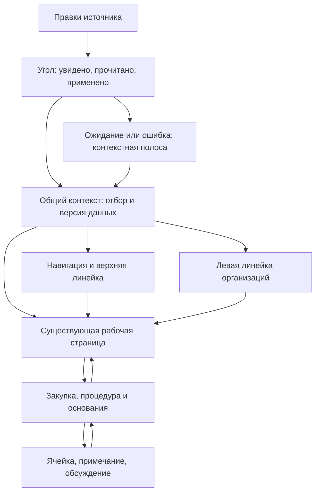

# Полная консолидация Dash: предметы, поведение и сохранность

10.10.2026. Рабочее решение по прямому поручению владельца, не акт приёмки. Исходная ревизия приложения: `2461209c8d0172c4acf94f5606452c589cd4f510`; перед этой работой main проверен повторно, SHA не изменился. Исходные HTML не изменяются. Пульс как страница исключён из переделки.

## Что означают замечания владельца

Консолидация означает соединение уже накопленных решений с требованиями и действующей логикой. Свободная перерисовка по мотивам — ошибка. Хорошая локальная картинка не компенсирует потерянную функцию, сломанную механику или обеднение содержания. Прошлый прототип Codex содержит упрощённые страницы и не может быть источником замены рабочих страниц.

Два уровня работы разделены явно: здесь — проверяемая визуальная проба общих предметов и сквозных сценариев; в приложении — последовательное изменение существующих компонентов с прежним store, API и содержимым страниц. Демонстрационная модель никогда не переносится в ядро. «Ноль регрессий» — условие допуска изменения, а не обещание отсутствия неизвестных дефектов после нескольких тестов.

## Карта источников: ничего не теряется молча

Полный прежний разбор 13 материалов: [HTML-REVIEW.md](../../audits/2026-10-10-dash-foundation/HTML-REVIEW.md). Здесь каждому назначено место; полнота означает учёт и решение, а не механическое включение взаимоисключающих исторических вариантов.

| Материал | Что сохраняем | Где используется / почему не переносится остальное |
|---|---|---|
| `pulse.html` | Исходная разметка навигационного цилиндра, перспектива трёх рядов, щит, геометрия периодов | Общая оболочка; содержание и демонстрационные расчёты Пульса не переносятся |
| `zarya-vystavka.html` | Свободные пары 13 разделов × Космос / Камчатка / Минералы; живая заря внутри; роли отделок | Точные пары извлекаются в данные пробы, применяются к тем же предметам. Космос — основной вариант этого исполнения, не ранее утверждённая тема |
| `otdelki.html` | Кэнди, металлик, перламутр, ксираллик, мат, стекло с ограничениями применения | Единая система назначений; контрольные образцы доступны в настройке внешнего вида |
| `zarya-arheologiya.html` | Внутренний градиент и память исходного рецепта | Преемственность; внешний ореол не подменяет зарю |
| `ugol-otbora-krupno.html` | 12 постоянных мест осей, четыре семейства, тихое умолчание, сброс и возврат | Прибор отбора; место клетки не зависит от числа включённых условий |
| `ugol-v-linejke-demo.html` | Реальный масштаб угла, увидено → прочитано, отсутствие изменений и связи | Компоновка рядом с эфиром; сценарии, а не рисованные факты |
| `ugol-varianty.html` | Читаемое раскрытие и счёт варианта Б; решётка А | Предлагаемое соединение. Отдельный сброс, без двусмысленного клика по самому прибору |
| `efir-uzel-schita.html` | Что изменилось / Комментарии / Откуда числа | Единый узел правого угла; старое предложение убрать нижнюю полосу уточняется текущим `LiveUpdateBar` |
| `palette-and-controls.html` | Выбрано / частично / фокус / возврат | Поведение сохраняется; устаревшее оформление не отменяет §21.1 |
| `2026-08-22-controls-sample.html` | Приоритет действий, локальное раскрытие, провал к основаниям и возврат | Проверка взаимодействия и понятности |
| `2026-08-22-palette-sample.html` | Различие цвета раздела, тревоги, бюджета и отключённого состояния | Семантические цвета не заменяются планетарным цветом |
| `2026-08-22-design-baseline-mockup.html` | История решений, смысл обновлений и объяснений | Не основание удалять существующие маршруты |
| Исторический `prototype.html` из `22d35c0` | История первоначальных задач | Не визуальный канон; статичные рейтинги и фиктивные действия не наследуются |

## Как устроено рабочее место

Зона данных получает оставшееся пространство. Навигация не дублируется декоративной боковой панелью. Слева остаётся существующий `OrgStrip` с характерными плашками и подведами. Ряды верхней линейки перестраиваются по доступной ширине, а надписи остаются целыми. На обычном ноутбуке не нужны большой титульный блок, повторяющие друг друга пояснения и пустые карточки вокруг таблицы. Уплотнение уменьшает промежутки; оно не удаляет столбцы и не делает весь текст микроскопическим.

## По каждому требованию

| Область | Решение и человеческий смысл | Как защищаем |
|---|---|---|
| Барабан разделов | Сохраняем цилиндр, три ряда, перспективу, выбранный раздел, колесо и клавиатуру. Все 13 разделов остаются | Не переписывать исходный фрагмент. Проверить длинные названия, Tab, стрелки, Home/End, смену фильтров |
| Космическая заря | У каждого раздела собственная пара из выставки. Выбранный предмет живёт внутри, не светится пустым кольцом | Проверять конечные и промежуточные цвета, светлую/тёмную тему, состояние фокуса. Цвет не единственный признак выбора |
| Отделки | Кэнди — выбранная вкладка и ключевой предмет; металлик — малые действия; перламутр — мягкий акцент; ксираллик — редкий отклик обновления; мат — данные; стекло — барабаны и раскрытия | Не складывать несколько физических материалов на одну поверхность. Искры не проходят по тексту. Сниженное движение даёт статичную пару |
| Левая линейка | Прямо использовать `OrgStrip.tsx` и `.ob-*`, а не новую крупную меню-панель | Все / управление с подведами / только управление / несколько подведов / раскрытие / полное доступное имя. Счёт — организации, не внезапно закупки |
| Годы, кварталы, месяцы | Полный текущий год при входе, несколько лет и месяцев, полный/частичный выбор, видимый квартал | Не скрывать квартальную кнопку ради места. Пустой явный выбор не превращается во «всё». Будущий план не считается нулевым исполнением |
| Недельные срезы | Отдельно время данных и период закупок. Срез хранит цифры, формулы и комментарии своей версии | **Обнаружено расхождение:** канон говорит пятница–пятница, текущий `WeekRoller` в `Header.tsx` использует понедельник–воскресенье. В пробе показываем целевой пятничный цикл, но продовые даты и ключи архива не мигрируем косметической правкой |
| Щит и щито-фильтр | Левый щит сохраняет роль обновления; родственный прибор справа отвечает за отбор. В репозитории это разные предметы | Не переназначать клик обновления на сброс. Если под «щито-фильтром» подразумевается их слияние — это отдельное решение, в этой пробе функции сохранены раздельно |
| 12 клеток угла | Когда: год, период, неделя. Кто: ГРБС, организация, категория. Что: способ, вид, бюджет. Как: ставка, единицы, поиск | Постоянный порядок из оригинала, текстовое раскрытие, отдельный сброс. Режим единиц не выдаётся за отбор строк; недоступная ось названа |
| Вебхук | Угол различает «увидели правку», «читаем», «готово», «применено», «ошибка», «режим неизвестен» | Подключение режима не доказывает свежесть чисел. Реальный паспорт — `/api/sources`, `refreshModeLine`; макет явно проигрывает демонстрацию |
| Нижняя полоса | Только ожидание безопасного применения или ошибка; понятная причина, Показать сейчас / Повторить / Скрыть | Скрыть не равно применить. Успех не вызывает новый шум. История в углу остаётся доступной после закрытия |
| Примечание ячейки | Небольшое пояснение с точным адресом | Не снабжать его чужими функциями ответов и закрытия |
| Обсуждение | Автор, сообщения, ответы, открыто/закрыто, происхождение и надёжность привязки | Текущий импорт Drive ещё не доказывает полный состав ответов, адрес и запись. Локальные кнопки пробы не обозначают готовый API |
| AF/AG/AH | Отдельные поля исходного листа | Не объединять с двумя видами комментариев; свободный текст не становится датой или суммой расчёта |
| Формула и значение | Видны рядом, с адресом и версией чтения | `{f,v}` и отображаемая строка различаются. Несогласованность чтений не прячется |
| Возврат и контекст | После карточки остаются отбор, место в списке, выделение и фокус | Открытие карточки и новая версия не сбрасывают работу; вводимый ответ не исчезает |
| Сигналы | Название, основание, охват, переход к строкам, действие | Полный номер — строка. Повтор номера не равен повтору закупки. AD-гейт не заменяется план−факт |

## Содержимое страниц: защищённый слой

Менять общую оболочку допустимо независимо от содержания. Включение новой карточки требует: задачу человека, заменяемое место, источник и формулу показателя, ограничения периода/организаций, состояния отсутствия данных, путь к доказательствам, проверку на реальном ответе API. Если любого пункта нет, исходная страница остаётся.

| Страница | Что переносим как есть при внедрении оболочки | Особая защита |
|---|---|---|
| Пульс | Действующий компонент | Содержание не входит в поручение |
| Отчёт | `Report` и Word-экспорт, документная компоновка, оглавление | Сейчас `OrgStrip` на Отчёте скрыт осознанно; нельзя вновь навесить отбор, не влияющий на документ |
| Свод | Действующий `Svod`, способы и бюджеты | В `PAGE_FILTERS` нет общей оси периода |
| Реестр | `DataBrowser`, таблица, столбцы, сортировка, виртуализация, выгрузка, карточка | Макетная таблица — не замена |
| Не обеспеченные | Корзина того же реестра | Правила классификации источника; не определять класс исключительно отсутствием года в демонстрации |
| В течение года | Корзина реестра | Способ фиксирован смыслом корзины; переключатель КП/ЕП не обещает лишний отбор |
| Мониторинг | Собственная процедурная книга и все её сравнения/связи | Общий отбор только по управлениям; свои деньги в рублях и поиск внутри страницы |
| Экономия | Действующие разложения и расчёты | AD, торговая экономия и свободный остаток не смешиваются |
| Конкуренция | Существующие сравнения способов | Не применять общий переключатель способа к сравнению |
| Дисциплина | Годовой список и бейдж периода | Управления, не несуществующий отбор подведов; квартал не становится скрытой трактовкой года |
| Аналитика | Реальные проверки наборов данных и карточки оснований | Не заменять на рисованные диаграммы |
| Контроль | Сверка, доверие, замечания, поручения, журнал и существующие переходы | Внешний барабан сохраняет все внутренние рабочие разделы |
| Система | Источники, паспорт обновления и имеющиеся настройки | Демонстрационные настройки внешнего вида не заменяют эту страницу |

Источник различий: `packages/web/src/store.ts:PAGE_FILTERS`, `App.tsx`, `Header.tsx`, `OrgStrip.tsx`, `components/live/{LiveHistory,ProvenanceHub,LiveUpdateBar}.tsx`.

## Допуск в приложение

1. Сначала общие цвета и материалы поверх существующей геометрии, с локальным возвратом к прежнему виду. Никаких изменений вычислений.
2. Затем барабан разделов подключается к прежнему `setPage`; TimeDrum, WeekRoller и OrgStrip сохраняют свой store и обработчики. Визуальная замена не меняет форму данных.
3. Угол получает состояние через `PAGE_FILTERS` и существующие действия очистки. Паспорт эфира, журнал и обновление используют настоящие хуки.
4. Два вида комментариев и недельная семантика получают отдельные изменения контрактов и тесты. Полные ответы, права записи, связь с ячейкой и архивная версия — предварительные условия, не косметика.
5. Страницы меняются только по отдельным доказанным улучшениям; до этого применяются общие токены, а содержание сохраняется.

Приёмка каждой порции: функции до/после; одинаковые результаты на одинаковом наборе и отборе; сохранение фокуса/прокрутки/черновика; оба режима темы; ширины ноутбука и компактные; длинные русские подписи; 200% текста; клавиатура; уменьшение движения; ошибки и пустоты; ручная эстетическая сверка с исходниками. Незакрытая потеря блокирует внедрение этой порции. Общие тесты monorepo имеют известные ранее красные случаи — их статус не маскируется зелёной пробой.

Принципы оформления сверены с первичными Apple HIG: [Materials](https://developer.apple.com/design/human-interface-guidelines/materials), [Layout](https://developer.apple.com/design/human-interface-guidelines/layout). Применяем различимую иерархию управления и содержания, читаемость и смысл материала. Нативный эффект Apple не обещается как точная копия средствами CSS.
