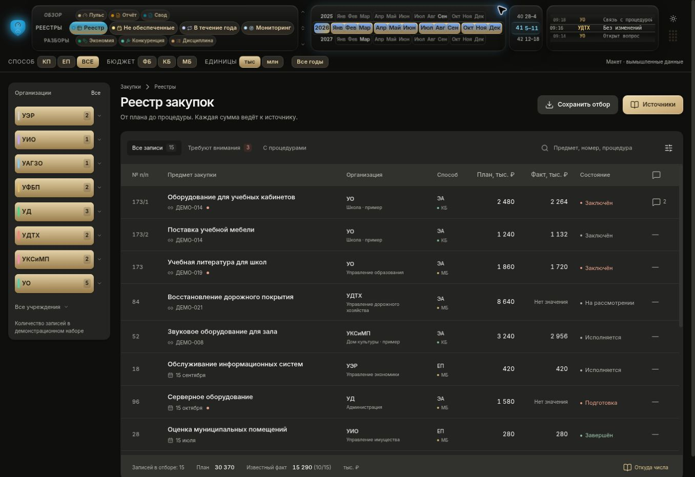

# ДЭШ — макет на основе существующей оболочки

**Рабочий прототип для просмотра. Не внедрён в приложение и не принят владельцем как окончательный дизайн.** Пульс исключён из переделки. Все 18 записей вымышленные; числа рабочего ДЭШ сюда не переносились.

Открыть: [Dash-concept.html](Dash-concept.html). Это один файл с интерфейсом, стилями и демонстрационными данными. Интернет нужен только для необязательного шрифта Inter; без него используется системный шрифт.



## Поправка владельца, 10 октября 2026

Первая сборка Codex слишком далеко ушла от существующей концепции: барабан был заменён сеткой из четырёх кнопок, верхняя линейка разрослась, изменилась композиция. Владелец прямо отверг это направление. Снимок сохранён только как антипример: [отклонённая сетка](evidence/rejected/grid-navigation.jpg). Не использовать его как целевой образец.

После замечания возвращена исходная оболочка. Это не новая версия дизайна «по мотивам»:

| Часть | Основа и сделанная работа |
|---|---|
| Барабан разделов | HTML навигации из соседнего `pulse.html` перенесён непосредственно. Сохранены три видимых ряда, перспектива, стекло и группы. Колесо, стрелки, Home/End работают через адаптер React. Длинные подписи получили ширину без многоточий и переносов. |
| Щит и материалы | SVG щита и CSS его материала, барабанов и органов выбора извлечены из того же оригинала. Источники и хеши — `src/source-shell/sources.json`. |
| Период | Геометрия и классы исходного барабана. Флажки месяцев разных лет действительно пересчитывают демонстрационный набор. Пустой набор не превращается во «все». |
| Организации | Возвращена вертикальная линейка; несколько управлений можно выбирать одновременно, учреждения раскрываются отдельно. |
| Правый угол | Форма прибора Б из `ugol-varianty.html`; просмотр условий, сброс и возврат. Б остаётся предложением, а не объявленным решением владельца. |
| Рабочая область | Реестр с карточкой закупки, источник, обсуждение, история и связанные строки процедуры. Это новая часть прототипа, а не существовавший экран Claude. |

Содержимое Пульса, его числовые утверждения, фиксированные ставки и правовые трактовки в прототип не перенесены. Варианты «Космос», «Камчатка», «Минералы» из выставки не объявлены выбранной владельцем темой.

## Что можно попробовать

- Открыть строку `173/1`: закупка → источник → обсуждение → история.
- В источнике увидеть отдельно формулу, вычисленное значение, примечание ячейки и поля AF/AG/AH.
- Добавить локальный ответ и закрыть/открыть обсуждение; состояние относится к выбранной записи.
- Раскрыть связь `ДЕМО-014` с двумя строками плана.
- Найти `173/2`, выбрать несколько управлений или месяцев разных лет, сбросить и вернуть отбор.
- Выгрузить CSV выбранных демонстрационных строк.
- Открыть все 13 разделов. У Пульса — явная пометка об исключении из переделки. Остальные разделы показывают связанные сценарии на одном наборе.
- Переключить тему; в «Системе» посмотреть доступный срез, чтение и потерю связи.

Экономия складывается только по AD. Известная сумма факта сопровождается количеством заполненных строк. Составные номера остаются строками. Совпадение меток не называется доказанным повтором закупки. Подробный аудит проекта: [CONSOLIDATION.md](../../audits/2026-10-10-dash-foundation/CONSOLIDATION.md).

## Границы прототипа и внедрение

Это проверяемая оболочка и сквозные сценарии, **не реализация всей функциональности действующего фронтенда**. Word, редактирование живых книг, настоящая история, разрешения, большие реестры и интеграции с сервером отсутствуют. Аналитические страницы показывают упрощённые представления. В полном продукте необходимо сохранить существующие сложные отборы, множественный выбор учреждений и бюджетов, сортировку, виртуализацию, сохранение контекста и прочие возможности текущих компонентов. Их нельзя заменить демонстрационным `model.mjs`.

Следующий этап — согласовать эту конкретную визуальную основу и состав недостающих экранов; затем переносить по компоненту в существующий фронтенд с его типами, API, реестрами метрик и сигналов. Исправление разбора составного номера в ядре остаётся отдельной задачей: этот макет его не исправляет.

## Запуск и проверка

```sh
npm ci
npm run dev -- --host 0.0.0.0
npm test
npm run standalone
```

`npm run standalone` пересобирает HTML. Для повторного извлечения исходных материалов: `node scripts/extract-source-shell.mjs` из этой папки. Не редактировать `original.css` вручную: поправки интеграции отделены в `integration.css`.

Результаты и ограничения проверки: [design-qa.md](design-qa.md). Основное приложение и исходные HTML не менялись.
