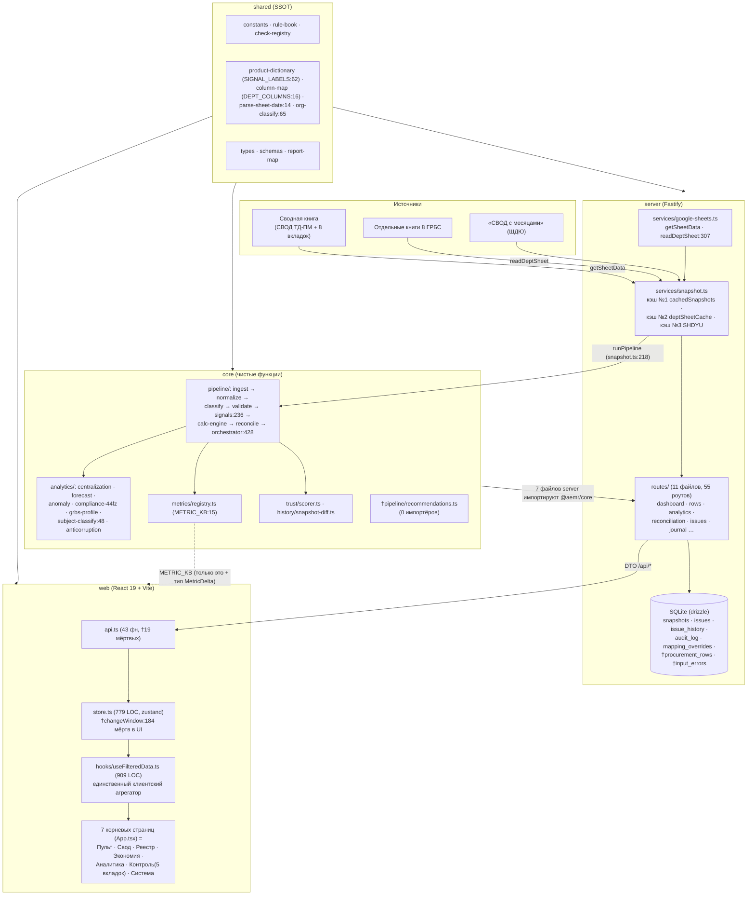
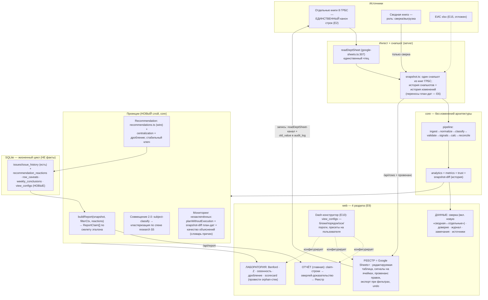

# Целевая схема архитектуры dash — as-is → to-be (2026-07-15)

> **Назначение.** Единая карта «что есть → что выкинуть → что строить», чтобы любой
> агент, открыв этот файл, понимал, куда класть код, какие модули канонические и что
> запрещено плодить. Проверено по коду на HEAD `5b50b85` (ветка
> `claude/refactor-consolidation`). Решения пользователя 15.07 вплетены (перечень —
> `docs/superpowers/plans/REMAINING-2026-07-15.md`, шапка и §2.2). Эпики E1-E15 ниже —
> оттуда же, это единый живой реестр остатка.
>
> Граф-разведка: `graphify-out/GRAPH_REPORT.md` (прогон 2026-07-15, 311 файлов,
> 1485 узлов / 1855 рёбер). God-узлы графа — `getSheetsApi` (10 рёбер), `CalcEngine` (9),
> `CheckResult` (9), `detectSignals` (8), `computeUnifiedGrid` (8), `inferSHDYURootCause` (8)
> — совпадают с ядром карты ниже. Кросс-файловых рёбер граф не извлёк («Surprising
> Connections: None»), поэтому межпакетные связи здесь построены грепом импортов
> (`@aemr/shared`, `@aemr/core`) и перечислены с доказательствами.

---

## §1. As-is: фактическая карта слоёв и потоков

### 1.1 Диаграмма

† — мертво/не доезжает до экрана (доказательства в §2).

### 1.2 Слои и их потребители (verified)

| Слой | Ключевые модули (канон) | Потребители |
|---|---|---|
| **shared** | `constants.ts`, `rule-book.ts` (653), `check-registry.ts` (510), `product-dictionary.ts` (SIGNAL_LABELS:62), `column-map.ts` (DEPT_COLUMNS:16), `parse-sheet-date.ts:14`, `org-classify.ts:65`/`org-itself.ts`, `sheet-classifier.ts`, `report-map.ts` (819), `types.ts`, `schemas.ts` | все три пакета (`grep -rl "@aemr/shared"`: 15 файлов web, все routes/services server, весь core) |
| **core/pipeline** | `orchestrator.ts` (`runPipeline`:428) — стадии: `ingest → normalize → classify → validate → signals` (`detectSignals`:236) `→ calc-engine → reconcile`; плюс `dataset-signals`, `unified-svod`, `shdyu-ingest`, `delta`, `input-control` | server: `snapshot.ts:1,218`, `routes/{dashboard,rows,analytics,history,reconciliation}.ts`, `services/source-validation.ts` — итого 7 файлов |
| **core/analytics** | `centralization`, `forecast`, `anomaly`, `compliance-44fz`, `grbs-profile`, `grbs-grade`, `discipline-index`, `subject-classify.ts:48`, `anticorruption` | `routes/analytics.ts` (частично — см. §2 orphan-роуты) |
| **core/metrics, trust, history** | `metrics/registry.ts` (`METRIC_KB`:15), `trust/scorer.ts`, `history/snapshot-diff.ts` | server + web (`main.tsx:7`, `lib/metrics-registry.ts:9` — единственный value-импорт core в web) |
| **server** | `services/google-sheets.ts` (`readDeptSheet`:307 — канон чтения книг ГРБС), `services/snapshot.ts` (`getSnapshot`:115 — 3 кэша), `routes/*` (11 файлов), `db/schema.ts` (9 таблиц) | web через `api.ts` |
| **web** | `api.ts` (43 клиентских функций) → `store.ts` (zustand) → `hooks/useFilteredData.ts` (909 LOC — весь клиентский расчёт) → 7 корневых страниц (`App.tsx:7-13`; Контроль = `Quality.tsx:4-8` нестит Trust/Recon/Issues/Recs/Journal) | пользователь |

### 1.3 Поток данных (главный контракт)

Google Sheets → `getSnapshot` (`snapshot.ts:115`, TTL-кэш per-year) → `runPipeline`
(`snapshot.ts:218` → `orchestrator.ts:428`) → `DataSnapshot` → `routes/dashboard.ts`
(600 LOC, **0 тестов** — главный DTO-контракт web) → `store.dashboardData` →
`useFilteredData` → страницы. Параллельный конвейер: `readDeptSheet` →
`deptSheetCache` → `/api/rows/*` → Реестр/TableEditor (запись обратно в Sheets).
**Корень дефекта D1: два конвейера не сверяются между собой** (карта механизмов
`2026-07-13-code-mechanism-map.md` §1, вердикт «НЕ СТАНДАРТ»; QA: УЭР 35 vs 76 строк).

### 1.4 Слепые зоны из графа (Part 1)

- **149 изолированных узлов** (GRAPH_REPORT «Knowledge Gaps») — преобладают
  одно-функциональные модули web/lib и python-скрипты `scripts/` (это норма для
  утилит), но туда же попали `bootstrap-kb-registry`, `useUrlSync`, `year-mismatch` —
  живые, просто с одним потребителем.
- **God-узлы кода** совпадают с god-файлами аудита: центр тяжести —
  `getSheetsApi`/`CalcEngine`/`detectSignals`/`computeUnifiedGrid`. Любая резка
  начинается с их потребителей, не с них самих.
- **Нарушение слоёв не найдено**: web не импортирует server; web→core ограничен
  `METRIC_KB` + `type MetricDelta` (grep §1.2). Реальная болезнь не в направлении
  стрелок, а в мёртвых окончаниях потока (§2).

---

## §2. Muda: что выкинуть/пережечь (с доказательствами)

Источник доказательств: `docs/superpowers/qa/code_quality_audit_2026-07-15.md` §4,
перепроверено точечно на HEAD.

| # | Muda | Доказательство | Судьба |
|---|---|---|---|
| M1 | **19 из 43 функций `web/api.ts` мертвы** (`getMetrics`, `getTrust`, `getHistory`, `exportAudit`, 6× `getAnalytics*`, …) | аудит §4.1: grep `api.<fn>` по web/src без тестов = 0 вызовов | E4: каждой — провести до экрана или снести; новые мёртвые обёртки запрещены (§5-12) |
| M2 | **~12 orphan-роутов server** (`/api/analytics/scorecard`, `/api/reconcile*`, `/api/history/diff`, `/api/load-all`, …) + все роуты за мёртвыми обёртками M1 | аудит §4.2: кросс-греп 55 роутов против api.ts | E4 (Трек F): «сутевка построена, но не доезжает до экрана» — провести или снести |
| M3 | **`core/pipeline/recommendations.ts` — мёртвый модуль**: не в `core/src/index.ts`, 0 импортёров | аудит §4.3; перепроверено грепом на HEAD | НЕ удалять — решение 15.07 «сначала вывести ядро»: wire в E4/E7 (сущность Recommendation) |
| M4 | **Мёртвые таблицы БД**: `input_errors` (`db/schema.ts:117`), `procurement_rows` (`schema.ts:148`) | grep `procurementRows\|inputErrors` вне schema.ts и тестов = 0 | `input_errors` — снести (E9); `procurement_rows` — оживить в E13 (автор/версия/время строки) |
| M5 | **Словари-заглушки shared**: `dictionaries/{kosgu,kvr,user-roles,grbs-registry}.ts` — 27 TODO, 0 потребителей вне shared | аудит §4.5 | снести из публичной поверхности (E12); возвращать только с реальным наполнением |
| M6 | **37/56 value-экспортов `core/src/index.ts` без импортёров** в server/web | аудит §4.4 | E12: сузить публичную поверхность (экспорт ≠ API) |
| M7 | **Живые дубли**: `SIGNAL_LABELS` ×3 (`shared/product-dictionary.ts:62` канон vs `DataBrowser.tsx:52`, `RowDetailCard.tsx:22`), `QUARTER_MONTHS` ×2, ~45 инлайн-форматтеров денег/%, magic-индексы `rows.ts` мимо `DEPT_COLUMNS` | аудит §4.6 | E11: свести к канонам; правила §5-4, §5-13 |
| M8 | **`store.changeWindow` мёртв в UI** (`store.ts:184,334` — определён, ни один .tsx не читает) | grep `changeWindow` по web/src/**/*.tsx = 0 | оживить в E3 («что изменилось за неделю»), не переписывать заново |
| M9 | **Сводная книга как канон строк** — архитектурная muda: второй источник тех же данных, порождающий Δ (УАГЗО +60 млн, невидимый МКУ «ЦЭР») | карта механизмов §1; QA D1 | решение 15.07: канон = **отдельные книги**; сводная уходит в роль сверки/выгрузки (E2) |
| M10 | **Старая IA 7 страниц** с тупиками навигации + 6 мёртвых компонентов | продукт-дизайн §4, §13 | переплавка в 4 раздела (E9) — страницы не удалять до переноса блока (карта сохранности §13) |

---

## §3. To-be: целевая схема

### 3.1 Диаграмма

### 3.2 Интерфейсы между блоками

| Интерфейс | Сигнатура/контракт | Статус |
|---|---|---|
| Источник → снапшот | `readDeptSheet(...)` (`google-sheets.ts:307`) — единственный вход строк; сводная книга читается только сверочным модулем | канон готов (`3c073c5`, `f8e775a`); пересадка DTO — E2 |
| Снапшот → пайплайн | `runPipeline(input: PipelineInput): DataSnapshot` (`orchestrator.ts:428`) | есть, не трогать |
| Снапшот → отчёт | `buildReport(snapshot, filterCtx, reactions): ReportClaim[]` — чистая функция в core, параметризована фильтрами (поправка §6.2.3 продукт-дизайна), НЕ синглтон | НОВОЕ (E3, фаза 1.4) |
| Отчёт → web | `GET /api/report?year&week&filters` → `ReportClaim[]`; исторический отчёт = проекция над историческим снапшотом | НОВОЕ (E3) |
| Рекомендация → реакция | ключ = (правило, ГРБС, отпечаток предметов), НИКОГДА индекс строки (§6.2.1); реакции в `recommendation_reactions`; исчезнувшая рекомендация архивируется, не удаляется (§6.2.2) | НОВОЕ (E7) |
| Реестр → Sheets (запись) | write-путь rows.ts через `DEPT_COLUMNS` (не magic-индексы), `old_value` в audit_log, undo | частично (E8) |
| История изменений | `history/snapshot-diff.ts` + снапшоты в БД → переносы план-дат (Δ4/Δ5 антифрод), «что изменилось за неделю» (оживить `store.changeWindow:184`) | кирпичи есть (E3/E6) |
| Конструктор → страницы | `view_configs` (БД): видимость/порядок блоков, оси, пороги, именованные пресеты; фундамент — словарь продукта + METRIC_KB как реестр доступных метрик | НОВОЕ (E10, ждёт shape-бриф — вопрос §4-5 REMAINING) |

### 3.3 Переиспользуется / появляется / умирает

- **Переиспользуется (не переписывать):** весь core/pipeline и analytics; `readDeptSheet`;
  `snapshot-diff`; `METRIC_KB`; `SIGNAL_LABELS`/словарь продукта; `subject-classify`
  (развить, не заменять); `issue_history`-паттерн overlay для статусов; TableEditor;
  `report-map.ts` (скелет эталона).
- **Появляется (НОВОЕ, минимум):** `core/report/build-report.ts` (проекция);
  таблицы `recommendation_reactions`, `row_caveats`, `weekly_conclusions`, `view_configs`;
  роут `/api/report`; сверочный модуль «сводная ↔ отдельные книги»; `web/lib/format.ts`;
  страница «Отчёт» + конструктор.
- **Умирает:** M1/M2 (мёртвые обёртки и orphan-роуты — после вердикта E4), M4
  `input_errors`, M5 словари-заглушки, M7-дубли, M9 сводная-как-канон, M10 старая IA
  (по карте сохранности §13 продукт-дизайна — ни один блок не теряется молча).

---

## §4. Миграционные шаги as-is → to-be

Порядок = критический путь REMAINING §3 (E1 → E2 → E3 — обязательная
последовательность; E4/E11 параллельно).

1. **E1 (in-progress): сигналы честные.** Фиксы триажа §3.1-3.8 (`signal_audit_2026-07-14.md`),
   плашка 5.4-A в recon-DTO, доверификация P0-4/P0-9. Нельзя строить отчёт на лгущих сигналах.
2. **E2: D1-переезд.** Характеризационный тест чисел Пульта/Свода на текущем источнике →
   пересадка dashboard-DTO на `readDeptSheet` → сводная книга в роль сверки; новый сверочный
   модуль «сводная ↔ отдельные» как проверка качества (вердикт карты механизмов §1).
3. **E3: buildReport-проекция** (фаза 1.4-1.6 мастер-плана) → `/api/report` → страница
   «Отчёт» с claim-оверлеями; оживить `changeWindow` («что изменилось за неделю»);
   реверс эталонной недели из `Отчеты по закупкам/`.
4. **E4 (параллельно, немедленно): проводка ядра.** Судьба каждого из 12 orphan-роутов и
   19 мёртвых функций api.ts; wire `recommendations.ts`; `datasetAnalyses` → DTO + панель
   Лаборатории.
5. **E11 (параллельно, ДО E8/E9): резка god-файлов.** Recon.tsx 1305 → Settings.tsx 1297 →
   Economy.tsx 1231 → rows.ts 1127 → Analytics.tsx 1021 → useFilteredData 909; свеп-хвосты
   M7 (SIGNAL_LABELS, QUARTER_MONTHS, `lib/format.ts`, magic-индексы). Иначе переплавка
   плавит god-файлы.
6. **E8: Реестр = Sheets+.** Провенанс правок (old_value), пресеты сигналов, экспорт при
   активных фильтрах (`api.ts:186-190` — самая старая живая просьба), массовые операции, undo.
7. **E5→E6/E7: продуктовая ветка.** Совмещение 2.0 (спека `research/joint-procurement-principles-2026-07-15.md`
   §5 поверх `subject-classify.ts`) → мониторинг незаключённых (385 строк; объяснения AE/AF +
   snapshot-diff план-дат) → рекомендации + реакции (таблица + UI + временна́я честность).
8. **E9→E10: переплавка IA в 4 раздела** (по карте сохранности §13) → dash-конструктор
   (`view_configs`; сперва shape-бриф — открытый вопрос §4-5 REMAINING).
9. **E13→E14: схема данных + платформа.** Устойчивый ключ строки (ИКЗ 24% + суррогат),
   `procurement_rows` в дело, ретенция снапшотов; RBAC/login вместо localStorage. E15 (ЕИС)
   — отложен решением 15.07.

---

## §5. Правила для агентов («пишешь X — используй Y, не создавай Z»)

1. **Читаешь строки закупок — только `readDeptSheet`** (`packages/server/src/services/google-sheets.ts:307`).
   Новый чтец Sheets не создавать; сводная книга — только для сверочного модуля (решение 15.07: канон = отдельные книги).
2. **Числа для UI берёшь из снапшота** (`runPipeline`, `packages/core/src/pipeline/orchestrator.ts:428` →
   dashboard-DTO). Не пересчитывай метрики на клиенте и не зови Sheets из роутов напрямую.
3. **Пороги 44-ФЗ, лимиты, правила — только `@aemr/shared`** (`constants.ts`, `rule-book.ts`,
   `check-registry.ts`). Хардкод порога в UI/сервере — дефект (правило уже в CLAUDE.md проекта).
4. **Подписи сигналов — `SIGNAL_LABELS`** (`packages/shared/src/product-dictionary.ts:62`).
   Локальные копии (сейчас `DataBrowser.tsx:52`, `RowDetailCard.tsx:22`) — на удаление, третью не создавать.
5. **Любой текст в UI — через словарь продукта** (`product-dictionary.ts`): ни один сырой ключ
   (`UNMAPPED`, `_org_itself`, `exec_count_pct`) не отрисовывается (продукт-дизайн §6.3).
6. **Классификация организаций — `org-classify.ts:65` / `org-itself.ts`** (shared). Свою
   эвристику «аппарат/ПБС/подвед» не писать — юр-канон один (`qa/org_canon.md`).
7. **Даты из ячеек — только `parseSheetDate`** (`packages/shared/src/parse-sheet-date.ts:14`).
   Свой парсер serial-дат запрещён (семья №1 свепа закрыта — не открывать заново).
8. **Колонки листа — только `DEPT_COLUMNS`** (`packages/shared/src/column-map.ts:16`).
   Magic-индексы (`rows.ts:876,941` и далее) — долг E11, новые не добавлять.
9. **Новая метрика — регистрация в `METRIC_KB`** (`packages/core/src/metrics/registry.ts:15`),
   не расчёт внутри компонента. web имеет право импортировать из core ТОЛЬКО `METRIC_KB` и типы.
10. **Новый сигнал — в `detectSignals`** (`packages/core/src/pipeline/signals.ts:236`) с тестом и
    строкой в SIGNAL_LABELS. Сигнал без канона AD «да/нет» из листа — сверяй с триажем E1.
11. **Отчёт строится только через `buildReport(snapshot, filterCtx, reactions)`** — чистая
    функция core, параметризованная фильтрами. Глобальный синглтон-отчёт запрещён (поправка §6.2.3):
    «фильтр показан ⇒ применяется» — контракт с тестом на каждый экран.
12. **Новый роут — только вместе с потребителем в web в том же изменении.** Уже ~12
    orphan-роутов и 19 мёртвых функций `api.ts` (аудит §4.1-4.2) — не пополнять; новая функция
    `api.ts` без вызова со страницы не коммитится.
13. **Форматирование денег/процентов — `web/src/lib/format.ts`** (создать при первом касании,
    E11); инлайн `toFixed` (~45 мест) не плодить.
14. **Жизненный цикл (статусы, реакции, оговорки, конфиги) — в SQLite; факты — в снапшоте.**
    Паттерн `issue_history`-overlay: стабильный естественный ключ, НИКОГДА индекс строки
    (поправка §6.2.1). Не смешивать: снапшот не хранит решений человека, БД не хранит расчётов.
15. **Похожесть закупок — развивай `subject-classify.ts`** (`packages/core/src/analytics/subject-classify.ts:48`)
    по спеке `research/joint-procurement-principles-2026-07-15.md` §5 (Жаккар + blocking по
    категории, порог 0.6, вето по ОКПД2). Не Levenshtein, не ОКПД2-справочник (решение 14.07).
16. **Не наращивай god-файлы:** `Recon.tsx` (1305), `Settings.tsx` (1297), `Economy.tsx` (1231),
    `rows.ts` (1127), `Analytics.tsx` (1021), `useFilteredData.ts` (909) — новая логика идёт в
    `web/lib/` или `server/services/` с тестом, не внутрь этих файлов (аудит §3).

---

*Связанные документы: REMAINING-2026-07-15.md (реестр остатка, эпики) ·
2026-07-13-report-2-0-product-design.md (продукт-дизайн, IA, модель данных) ·
2026-07-13-code-mechanism-map.md (трассировка механизмов) ·
qa/code_quality_audit_2026-07-15.md (доказательства muda) ·
research/joint-procurement-principles-2026-07-15.md (совмещение 2.0) ·
graphify-out/GRAPH_REPORT.md (граф 2026-07-15).*
